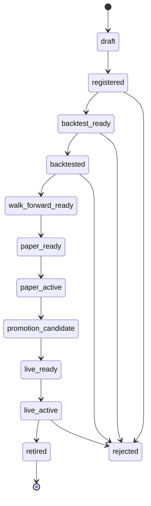
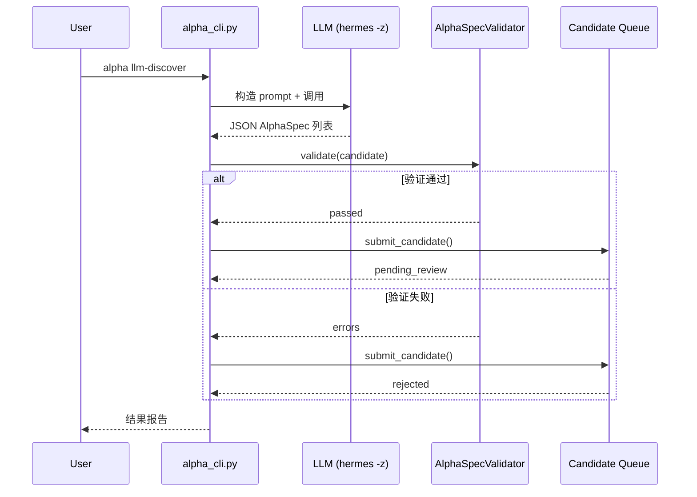
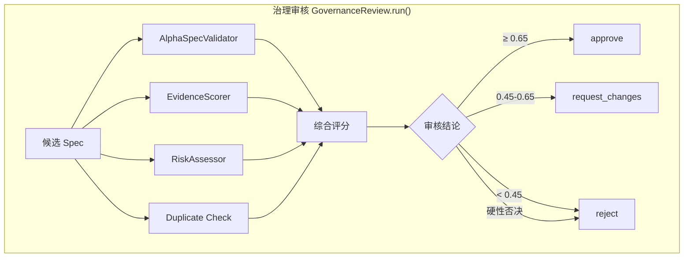

# Alpha Factory

# Alpha Factory 模块文档

**版本**: V3.9  
**模块路径**: `commands/factor_lab/alpha/`  
**设计目标**: 构建 Alpha 因子的全生命周期管理体系，从候选生成、验证、治理审核、晋级注册到退役治理的端到端管道。

## 概述

Alpha Factory 是一个面向 A 股的量化因子工程平台，提供了完整的 Alpha 生命周期管理能力。它将因子定义从 Python 代码提升为结构化规格（AlphaSpec），并通过可审查的管道控制因子从概念到注册的流转。

系统的核心设计原则是**安全先置**：所有 Alpha 注册时默认 `enabled=False`，审核、晋级、退役操作均不会自动触发交易或修改实盘配置。

### 设计架构

```
┌────────────────────────────────────────────────────────────┐
│                      CLI 入口 (alpha_cli.py)                 │
├──────────┬──────────┬──────────┬──────────┬────────────────┤
│ LLM 发现  │ Alpha Packs │ 治理审核  │ 晋级/退役 │ 报告/导出      │
│ V3.7     │ V3.1-V3.5  │ V3.8     │ V3.9     │ V3.0           │
└────┬─────┴─────┬─────┴────┬──────┴────┬─────┴────────────────┘
     │           │          │           │
┌────▼────┐┌────▼────┐┌────▼────┐┌────▼────┐┌──────────────────┐
│ Alpha   ││ 加载器   ││Govern- ││Promotion││ 文件系统          │
│ Schema  ││(数据流/  ││ance    ││Engine   ││ Registry          │
│ V3.0    ││ 事件)   ││V3.8    ││V3.9     ││ (HermesData)      │
└─────────┘└─────────┘└─────────┘└─────────┘│ Retirement        │
                                            │ Engine V3.9       │
                                            │ Lifecycle V3.0    │
                                            └──────────────────┘
```

## Alpha 生命周期

Alpha 在系统中经历从草稿到退役的完整状态流转，由 `AlphaLifecycle` (`lifecycle.py`) 管理。



状态迁移由 `TRANSITIONS` 字典定义，`can_transition()` 和 `transition()` 方法强制执行合法性检查。不合法的迁移返回错误，不会产生副作用。

**关键状态说明**:

| 状态 | 含义 |
|------|------|
| `draft` | 草稿，初始状态 |
| `registered` | 已注册到 Registry |
| `backtest_ready` | 可进行回测 |
| `paper_active` | Paper trading 中 |
| `promotion_candidate` | 可晋级候选 |
| `live_active` | 实盘中 |
| `retired` / `rejected` | 终结状态 |

## AlphaSpec — 因子规格定义

`schema.py` 中的 `AlphaSpec` 数据类是所有 Alpha 的核心数据结构。

```python
@dataclass
class AlphaSpec:
    alpha_id: str = ""              # 自动生成，格式: alpha_{timestamp}
    name: str = ""                  # 因子名称 (snake_case)
    description: str = ""           # 描述
    hypothesis: str = ""            # 投资假设
    universe: str = "all_watchlist" # 选股域
    data_requirements: list = ...   # 所需数据字段
    factor_expression: str = ""     # 因子表达式
    signal_direction: str = "long"  # long / short / long_short
    rebalance_frequency: str = "monthly"
    risk_constraints: dict = ...    # 风险约束
    author: str = "system"
    source: str = "manual"
    version: str = "0.0.1"
    status: str = "draft"           # 当前生命周期状态
    enabled: bool = False           # 默认禁用
    paper_enabled: bool = False
    live_enabled: bool = False
    tags: list = []
```

## Alpha Registry — 注册表

`registry.py` 实现了基于文件系统的注册表管理。

**数据存储**: `/mnt/d/HermesData/alpha_registry/`

```
alpha_registry/
├── registry_index.json          # 索引文件 (轻量列表)
├── alpha_20260707_120000/      # 每个 Alpha 独立目录
│   ├── alpha_spec.json
│   ├── versions/
│   ├── artifacts/
│   ├── evaluation/
│   └── promotion_history/
└── alpha_20260707_120001/
    └── ...
```

**核心函数**:

| 函数 | 功能 |
|------|------|
| `register_alpha(spec)` | 注册 Alpha，创建文件系统目录，写入审计 |
| `list_alpha()` | 列出所有已注册 Alpha (读取索引) |
| `get_alpha(alpha_id)` | 获取 Alpha 完整规格 (读取 spec.json) |
| `update_alpha_status(alpha_id, status)` | 更新状态，执行生命周期检查 |
| `retire_alpha(alpha_id)` | 便捷退役函数 |
| `export_registry(path)` | 导出 CSV 格式注册表 |

每次注册操作自动写入 `AuditTrail` 和 `ArtifactManifest`，确保可追溯。

## CLI 接口总览

`alpha_cli.py` 提供了 20+ 子命令，分类如下：

### 基础操作
```
alpha register --spec <path>        # 注册 Alpha
alpha list                          # 列表 Alpha
alpha show --alpha-id <id>          # 查看详情
```

### LLM Alpha Discovery (V3.7)
```
alpha llm-discover --context "..." --num 3   # LLM 生成候选
alpha llm-candidates --status pending_review # 列出候选
alpha llm-approve --candidate-id <id>        # 审批候选
alpha llm-reject --candidate-id <id> --reason "..."  # 拒绝候选
alpha llm-rejected-report                   # 拒绝原因报告
alpha llm-validate --spec <path>            # 验证 AlphaSpec
```

### Governance (V3.8)
```
alpha review --candidate-id <id>     # 治理审核
alpha governance-report              # 审核报告
alpha governance-list                # 审核状态列表
```

### Promotion (V3.9)
```
alpha promote --candidate-id <id>    # 晋级候选
alpha batch-promote --max-count 10   # 批量晋级
alpha promotion-report               # 晋级报告
```

### Retirement (V3.9)
```
alpha retire --alpha-id <id> --reason "..."  # 手动退役
alpha auto-retire --dry-run                   # 自动退役评估
alpha retirement-report                       # 退役报告
alpha retirement-policy                       # 查看策略
alpha retirement-policy-update --key <k> --value <v>
```

### 初始化与迁移
```
alpha init-samples               # 创建 3 个示例 Alpha
alpha migrate-existing-factors   # 迁移已有因子到 Registry
```

### 生成报告
```
# alpha_cli.py 无参运行 → generate_factory_report()
# 输出到 /mnt/d/HermesReports/alpha_factory/{run_id}/
```

## LLM Alpha Discovery (V3.7)

`llm_alpha_discovery.py` 实现了 LLM 驱动的 Alpha 候选生成管道。

### 工作流程



### 提示词模板

`LLM_ALPHA_PROMPT_TEMPLATE` 是一个结构化的 LLM 提示词，包含：
- 输出字段定义（name, hypothesis, factor_expression 等 11 个必填字段）
- 可用算子列表（cross-sectional, time-series, technical, non-linear, logical）
- 可用数据字段（close, volume, amount 等）
- 关键约束规则（禁止负 window、禁止零 window、禁止策略配置等）

### AlphaSpecValidator

验证维度：

| 检查项 | 方法 | 说明 |
|--------|------|------|
| 字段完整性 | `_check_required_fields` | 11 个必填字段非空 |
| 信号方向 | `_check_signal_direction` | 仅允许 long/short/long_short |
| 再平衡频率 | `_check_rebalance_frequency` | 仅允许 daily/weekly/monthly |
| 字段长度 | `_check_field_lengths` | name≤60, expression≤500 |
| 可计算性 | `_check_expression_computable` | 调用 ExpressionParser |
| 未来函数 | `_check_future_function` | window≥2, 禁止 ts_delta(x,0) |

### 候选队列

候选存储在 `/mnt/d/HermesData/alpha_candidates/`：

```
alpha_candidates/
├── candidates_index.json          # 索引 (轻量)
├── cand_20260707_120000_000000/  # 每个候选独立目录
│   ├── candidate.json            # 完整候选记录 + spec
│   ├── governance_review.json    # 治理审核记录 (V3.8)
│   └── promotion_record.json     # 晋级记录 (V3.9)
└── cand_20260707_120001_000000/
```

候选状态流转：`pending_review → approved | rejected → promoted`

## Alpha Governance (V3.8)

`governance.py` 提供治理审核层，对 Alpha 候选进行多维评估。



### EvidenceScorer — 证据评分

评估候选的证据维度：

- **来源可信度**: 学术论文(1.0) > 行业报告(0.9) > 金融理论(0.8) > 实证观察(0.7) > LLM 推理(0.4) > 未知(0.3)
- **完整性**: 证据文本(0.3) + 详细假设(0.3) + 详细描述(0.2) + 风险说明(0.2)
- **质量**: 长度(0.3) + 具体数据(0.3) + 引用来源(0.2) + 具体示例(0.2)

评级: `≥ 0.7 = strong`, `≥ 0.4 = moderate`, `< 0.4 = weak`

### RiskAssessor — 风险评估

评估四个风险维度：

| 风险维度 | 权重 | 检测方式 |
|---------|------|---------|
| 过拟合 (overfitting) | 30% | 关键词命中 + 表达式复杂度 |
| 体制依赖 (regime dependency) | 25% | 市场状态关键词命中 |
| 容量 (capacity) | 20% | 流动性关键词命中 |
| 实现 (implementation) | 25% | 交易成本关键词命中 |

表达式复杂度评估函数调用数、运算符数、条件语句数，综合计算过拟合风险。

### GovernanceReview — 综合评分

权重配置: 验证(30%) + 证据(25%) + 风险(25%) + 新颖性(20%)

**硬性否决条件**: 验证不通过 或 候选重复 → 直接 `reject`

## Promotion Engine (V3.9)

`promotion_engine.py` 将治理批准的候选晋级到 Alpha Registry。

### 晋级流程

1. 验证候选已被 governance approve
2. 从 candidate spec 构建 AlphaSpec 实例
3. 调用 `register_alpha()` 注册到 Registry
4. 更新候选状态为 `promoted`
5. 复制 governance review 到 alpha 目录
6. 持久化晋级记录到文件和历史
7. 更新晋级队列状态

### PromotionQueue

晋级队列管理：
- `add(candidate_id, priority)` — 加入队列（自动取 governance score 为默认优先级）
- `remove()` / `list_queue()` / `update_status()` / `clear_completed()`
- `queue_stats()` — 队列统计（总量、按状态分布、优先级范围）

## Retirement Engine (V3.9)

`retirement_engine.py` 管理 Alpha 退役治理。

### RetirementPolicy

可配置的退役策略：

| 策略 | 默认值 | 说明 |
|------|--------|------|
| `ic_threshold` | 0.02 | IC 低于此值触发警告 |
| `max_drawdown` | 0.30 | 回撤超过此值触发退役 |
| `max_stale_days` | 90 | 超过此天数未更新触发退役 |
| `min_evidence_score` | 0.3 | 证据评分过低触发审查 |
| `max_risk_score` | 0.7 | 风险评分过高触发审查 |
| `auto_retire_enabled` | True | 是否启用自动退役 |
| `require_human_approval` | True | 退役是否需要人工确认 |

### 自动退役评估

`auto_retire()` 遍历所有 active 状态的 Alpha，按策略逐项评估：

- 检查 IC、回撤、时效性、证据评分、风险评分
- **critical** 级别: 自动执行退役（若 `auto_retire_enabled=true` + `require_human_approval=false`）
- **warning** 级别: 持续监控
- **dry_run** 模式: 仅报告不执行

## Alpha Packs — 预定义因子包

系统提供了四组预定义的 Alpha Pack，每组独立可运行，支持 `dry_run` 模式。

### 1. 行业相对 Alpha Pack (V3.1)

`industry_alpha_pack.py` — 行业中性化因子

| Alpha | 描述 |
|-------|------|
| `industry_relative_momentum` | 行业相对 5 日动量 (ret5 行业中位数调整) |
| `industry_relative_low_vol` | 行业相对低波动 |
| `industry_neutral_quality` | 行业内 ROE+毛利率+净利率等权排名 |
| `industry_relative_volume` | 行业相对量比 |
| `industry_neutral_multi_factor` | 行业中性多因子复合 (动量+低波+量比) |
| `cross_sector_strength` | 跨行业相对强度 |
| `industry_relative_fund_flow` | 行业相对资金流 (主力净流入排名) |

配套组件：**IndustryMapper** (`industry_mapper.py`) 提供股票到行业的映射，数据源优先级：Baostock → 本地 CSV → tag_features fallback → unknown 兜底。

### 2. 数据增强 Alpha Pack (V3.3)

`data_enrichment_alpha_pack.py` — 北向/两融/资金流增强因子

**资金流** (5 个): `fund_flow_composite_alpha`, `institutional_flow_leader`, `flow_divergence_momentum`, `super_large_resonance`, `consecutive_capital_inflow`

**北向资金** (3 个): `north_flow_alpha`, `north_holding_increase`, `north_flow_momentum`

**两融** (5 个): `margin_net_buy_alpha`, `margin_balance_surge`, `margin_long_sentiment`, `margin_flow_momentum`, `sec_lending_decrease`

配套组件：**DataEnrichmentLoader** (`data_enrichment_loader.py`) 提供统一数据加载：
- `load_fund_flow()` — 资金流 (`fund_flow_timeseries.csv`)
- `load_north_flow()` — 北向 (`north_flow_timeseries.csv`)
- `load_margin()` — 两融 (`margin_timeseries.csv`)
- `get_enriched_data()` — 统一入口
- `merge_enriched()` — 合并到主 DataFrame

所有加载器在数据缺失时优雅降级，返回空 DataFrame。

### 3. 技术形态 Control Pack (V3.4)

`technical_pattern_alpha_pack.py` — MACD/KDJ/Boll 控制基线

所有技术指标以 `role="control"` 注册，不作为主要 Alpha 信号：

| 类别 | 因子 | 角色说明 |
|------|------|---------|
| MACD | `macd_dif_control`, `macd_histogram_control`, `macd_cross_control` | 动量基线参考 |
| KDJ | `kdj_k_control`, `kdj_d_control`, `kdj_j_control`, `kdj_cross_control` | 超买超卖参考 |
| Bollinger | `boll_width_control`, `boll_position_control`, `boll_breakout_control` | 波动率参考 |

### 4. 事件驱动 Alpha Pack (V3.5)

`event_alpha_pack.py` — 解禁/回购/分红/业绩预告事件因子

| 事件类型 | Alpha | 逻辑 |
|---------|-------|------|
| 🔴 解禁 | `lockup_expiry_guard` | 解禁前抛压预警 (short) |
| 🟢 回购 | `buyback_confidence` | 回购公告信号 (long) |
| 🟡 分红 | `dividend_yield_value` | 高股息率选股 (long) |
| 🔵 业绩预告 | `forecast_positive_catalyst` | 预增催化剂 (long) |
| 🟣 复合 | `event_composite_alpha` | 多事件信号共振 |

配套组件：**EventLoader** (`event_loader.py`) 提供事件数据加载：
- `load_lockup_events()` — 从 announcements_extracted.csv 筛选解禁公告
- `load_buyback_events()` — 筛选回购公告
- `load_dividend_events()` — 从 adjust_factor.csv 提取股息
- `load_forecast_events()` — 从 forecast_report.csv 加载业绩预告
- `get_event_data()` / `merge_event_data()` — 统一入口

## 因子目录迁移 (V3.0.1)

`factor_catalog_migration.py` 将 `factor_base.py` 中已有的 86+ 因子迁移到 Alpha Registry。

迁移过程会：
1. 从 `list_factors()` 获取完整因子列表
2. 检查重复（已注册的跳过）
3. 为每个因子构建 AlphaSpec
4. 注册到 Registry（默认 disabled）
5. 生成 15 种输出文件，包括：
   - JSON/CSV/HTML/Markdown 报告
   - 因子-映射 CSV
   - 数据需求 CSV
   - 相关性基线 CSV
   - Registry 更新预览 JSON
   - Audit log

## 报告生成

所有操作都会自动生成结构化报告，输出到 `/mnt/d/HermesReports/`：

| 报告 | 生成位置 |
|------|---------|
| Factory 总报告 | `alpha_factory/{run_id}/` |
| 行业 Alpha Pack | `industry_alpha_pack/{run_id}/` |
| 数据增强 Pack | `data_enrichment_alpha_pack/{run_id}/` |
| 技术形态 Pack | `technical_pattern_alpha_pack/{run_id}/` |
| 事件驱动 Pack | `event_alpha_pack/{run_id}/` |
| 因子迁移 | `alpha_factor_migration/{run_id}/` |
| LLM 发现日志 | `llm_alpha_discovery/{run_id}/` |
| 治理报告 | `alpha_governance/{run_id}/` |
| 晋级报告 | `alpha_promotion/{run_id}/` |
| 退役报告 | `alpha_retirement/{run_id}/` |

每个报告包含 JSON 数据 + HTML 可视化 + CSV 导出 + 审计日志。

## 安全边界

系统在每一层都实施了安全保护：

```
验证层 (V3.7):
  - auto_apply=False
  - no_live_trade=True
  - 不下单、不改策略配置
  - AlphaSpec 默认 enabled=False

治理层 (V3.8):
  - 硬性否决条件 (验证不通过/重复)
  - require_human_approval 可选

晋级层 (V3.9):
  - 仅已批准的候选可晋级
  - 晋级后 alpha 默认 disabled
  - registry 操作审计追踪

退役层 (V3.9):
  - 退役后 enabled/paper_enabled/live_enabled = False
  - 自动退役 require_human_approval
  - 历史记录不可篡改 (append-only JSONL)

Alpha Pack:
  - 所有预定义 Alpha: enabled=False
  - 安全标签: ["no_live_trade"]
```

## 依赖关系

```
alpha_cli.py ─── CLI 分发层
    ├── schema.py ─── AlphaSpec 数据类
    ├── lifecycle.py ─── 状态机
    ├── registry.py ─── 注册表管理
    │   ├── core.audit.py ─── 审计追踪
    │   └── core.artifact.py ─── 制品清单
    ├── evaluation_hook.py ─── 评估计划
    ├── sample_alphas.py ─── 示例数据
    ├── factor_catalog_migration.py ─── 因子迁移
    │   └── core.migration.py ─── 迁移兼容层
    ├── llm_alpha_discovery.py ─── LLM 发现
    │   ├── expression_parser.py ─── 表达式解析
    │   └── factor_base.py ─── 因子目录
    ├── governance.py ─── 治理审核
    ├── promotion_engine.py ─── 晋级引擎
    ├── retirement_engine.py ─── 退役引擎
    ├── industry_mapper.py ─── 行业映射
    │   └── baostock_data.py ─── 股票数据源
    ├── industry_alpha_pack.py ─── 行业 Pack
    ├── data_enrichment_alpha_pack.py ─── 数据增强 Pack
    ├── data_enrichment_loader.py ─── 数据加载器
    ├── technical_pattern_alpha_pack.py ─── 技术形态 Pack
    ├── event_alpha_pack.py ─── 事件 Pack
    └── event_loader.py ─── 事件加载器
```

## 外部数据依赖

| 数据文件 | 路径 | 提供方 |
|---------|------|--------|
| 资金流 | `data/fundamentals/fund_flow_timeseries.csv` | factor_base |
| 北向资金 | `data/fundamentals/north_flow_timeseries.csv` | factor_base |
| 两融 | `data/fundamentals/margin_timeseries.csv` | factor_base |
| 公告 | `data/fundamentals/announcements_extracted.csv` | 数据管道 |
| 复权因子 | `data/market/adjust_factor.csv` | 数据管道 |
| 业绩预告 | `data/fundamentals/forecast_report.csv` | factor_base |
| 股票池 | DATA_HUB/market/pool.csv | 数据中枢 |
| 行业映射 | `data/tags/stock_industry.csv` | baostock |