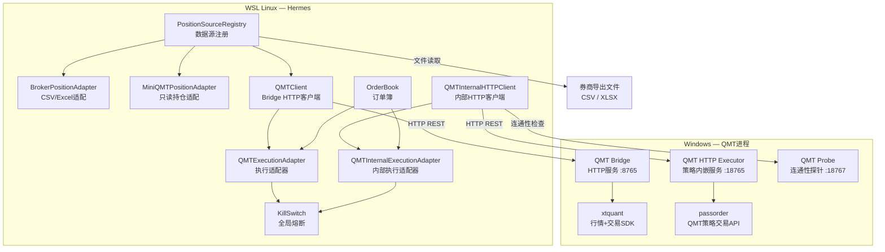
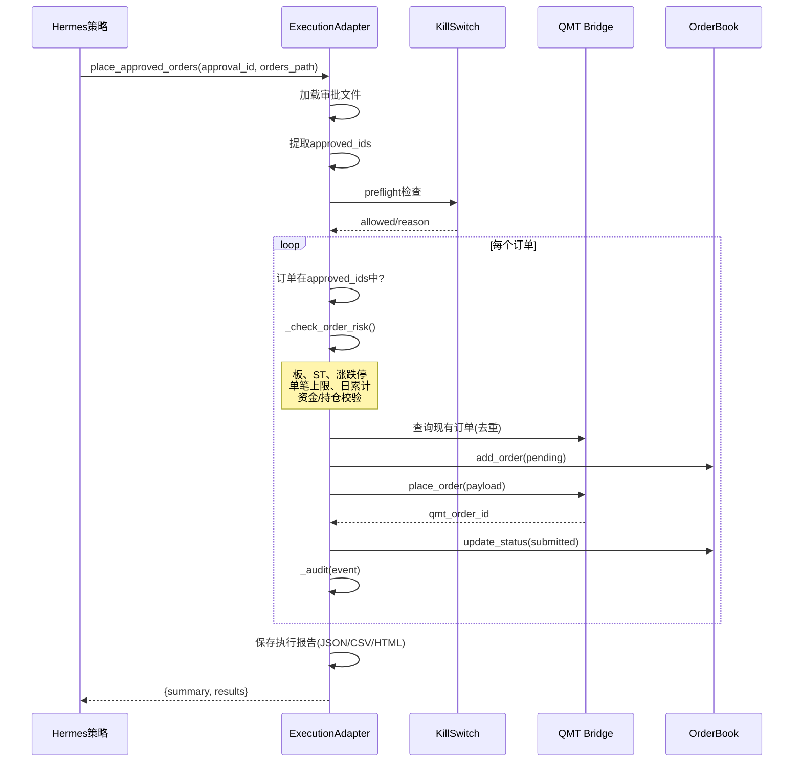

# Broker & QMT Connectivity

# 经纪商与 QMT 连接模块

## 概述

Broker & QMT Connectivity 模块是 Hermes 量化系统连接真实交易通道的桥梁。它在只读数据接入与可执行交易之间划出了明确的安全边界，通过两层适配器架构、审批门控、运行时风控和全链路审计，确保实盘操作始终处于受控状态。

模块覆盖三个核心能力：

- **持仓数据接入** — 从券商导出的 CSV/Excel 文件、miniQMT 只读接口、Windows QMT Bridge 三个来源读取持仓并标准化为统一格式
- **实时行情查询** — 通过 WebSocket 框架（V5.2）采集 tick 级行情，同时提供 xtquant 直连快照行情作为后备
- **交易执行** — 审批 → 风控预检 → 桥接下发 → 状态同步的完整链条，支持 Hermes 端 QMT Bridge 和 Big QMT 内部 HTTP 执行器两条路径

---

## 架构总览

系统采用**双端混合架构**（WSL Linux + Windows QMT）：



### 关键设计原则

1. **只读缺省** — `miniQMT` 模块和 `MiniQMTPositionAdapter` 默认不导出任何交易方法，`verify_readonly_guard()` 运行时扫描确保此约束
2. **审批门控** — 所有实盘下单必须先通过 `place_approved_orders(approval_id, orders_path)`，系统加载审批文件，检查每个订单的 `approval_status` 是否在许可集合中
3. **风控链** — 每个订单在发送前经过顺序检查：熔断状态 → Bridge 健康 → 交易板限制 → ST/停牌/涨跌停过滤 → 单笔金额上限 → 日累计金额上限 → 资金/持仓校验
4. **幂等防护** — `client_order_id` 去重：同一 approval_id + order_id 组合不会发送两次
5. **全链路审计** — 每条路径都将所有事件（阻塞、拒绝、提交、成交）写入 JSONL 审计文件

---

## 持仓接入层

### 数据来源统一入口

`position_source_registry.resolve_source(config)` 是统一入口，按 `fallback_order` 依次尝试数据源，自动选择第一个可用的：

```python
config = {
    "preferred": "broker_export",
    "fallback_order": ["broker_export", "manual_csv"],
    "broker_export": {"path": "/mnt/d/export/持仓.csv", "encoding": "auto"},
}
result = resolve_source(config)
# result.source_used → "broker_export" 或回退到 "manual_csv"
```

### 券商导出适配器

`BrokerPositionAdapter` 的核心是 `read_positions(path, field_map)`：

- 自动识别 CSV/Excel 格式，CSV 支持 `utf-8-sig / utf-8 / gbk / gb2312` 编码轮询
- 内置 `DEFAULT_FIELD_MAP` 映射常见中文字段名（证券代码→symbol、持仓数量→shares 等）
- `_validate()` 阶段执行：symbol 首位数合法性校验、持仓手数检查（100股整数倍）、可用数不超过持仓数
- 通过 `factor_lab.live.account_profile.get_board()` 自动识别板块归属
- 现金行（`CASH`）单列处理，不进入标的持仓列表

### miniQMT 只读适配器

`MiniQMTPositionAdapter` 封装了所有只读操作：

- `is_available()` — 检查 `xtquant` 是否可导入，不建立网络连接
- `load_account_asset()` / `load_positions()` — 骨架实现，TODO 标记待替换为正式 QMT 调用
- `normalize_positions(raw)` — 标准化持仓格式，添加板块和盈亏计算
- `verify_readonly_guard()` — 运行时反射扫描，确认 `buy/sell/order` 等交易方法未被意外暴露

### xtquant 直连层

`miniqmt/__init__.py` 提供更底层的 xtquant 只读封装：

- `connect()` — 调用 `xtdata.run()` 连接到本地 QMT 客户端
- `query_positions()` / `query_account()` — 查询并缓存到 `data/qmt/`，离线和后备场景返回缓存数据
- `get_market_quote(symbols)` — 实时快照行情，自动处理 SH/SZ 前缀
- `place_order()` — 显式返回 `blocked`，从 API 层面禁止下单

---

## QMT Bridge 执行路径

### 架构

Hermes（WSL）通过 HTTP 与 Windows 上的 QMT Bridge 进程通信，避免在 WSL 中直接导入 xtquant：

```
Hermes                        Windows
┌──────────────┐     HTTP     ┌─────────────────────┐
│ QMTClient     │────────────▶│ qmt_bridge.py       │
│ (urllib)      │◀────────────│ ThreadingHTTPServer │
└──────────────┘              │ QMTBackend(xtquant) │
                              └─────────────────────┘
```

### QMTClient

`QMTClient` 是纯 urllib HTTP 客户端，不导入任何 xtquant。配置通过 `QMT_BRIDGE_BASE_URL` 环境变量注入，默认超时 5 秒。

提供的方法按功能分组：

| 类别 | 方法 |
|------|------|
| 状态 | `health()`, `is_configured()` |
| 行情 | `get_quotes(symbols)`, `get_bars(symbol, period, count)` |
| 账户 | `get_account()`, `get_positions()` |
| 订单 | `get_orders()`, `get_trades()`, `place_order()`, `cancel_order()` |

所有方法返回统一的 `{status, request_id, timestamp, data, error}` 结构，网络/解码异常映射到 `_local_error()`。

### QMT Bridge 服务端

`scripts/qmt_bridge.py` 运行在安装了 xtquant 的 Windows 机器上：

- `QMTBackend._connect()` — 初始化 xtdata（只读行情），可选初始化 XtQuantTrader（交易）
- 环境变量控制：`QMT_XTDATA_PORT`、`QMT_USERDATA_PATH`、`QMT_ACCOUNT_ID`、`QMT_LIVE_TRADING_ENABLED`
- 所有请求和响应写入 `qmt_bridge_audit.jsonl`
- 实盘下单受 `QMT_LIVE_TRADING_ENABLED=1` 保护

### QMTExecutionAdapter

`QMTExecutionAdapter` 是所有实盘操作的唯一入口。关键流程 `place_approved_orders()`：



### 实时状态同步

`sync()` 方法批量拉取账户、持仓、订单、成交数据：

- 调用 Bridge 四个只读端点
- 将 `OrderBook` 中的订单状态与 Bridge 返回的实际状态对齐（`_apply_order_statuses`）
- 处理成交回填（`_apply_trade_fills`）
- 输出结构化报告（JSON + CSV + HTML）
- 持久化审计事件到 JSONL

---

## Big QMT 内部 HTTP 执行路径

### 动机

Big QMT 的策略执行器需要通过 QMT 自有 API (`passorder`) 在 `handlebar` 上下文中下单。Hermes 无法直接从外部调用 `passorder`，因此需要在 QMT 策略进程内嵌入一个 HTTP 服务，Hermes 通过此服务**排队**订单，由 `handlebar` 逐笔消费。

### 组件

**Hermes 端：**

- `QMTInternalHTTPClient` — HTTP 客户端，通过 `X-Hermes-Token` 头认证
- `QMTInternalExecutionAdapter` — 执行适配器，逻辑与 `QMTExecutionAdapter` 基本相同，但：
  - 订单发送到执行器的 `/orders/place` 端点（不直接过 Bridge）
  - 响应状态为 `queued` 而非 `submitted`
  - 提供 `enable_live()` / `disable_live()` 控制执行器状态
  - `Symbol` 自动标准化为 `.SZ` / `.SH` 后缀

**QMT 策略端：**

- `scripts/qmt_internal/qmt_http_executor_strategy.py` — 粘贴到 Big QMT Python 策略编辑器中的完整策略代码
- 启动 `ThreadedHTTPServer(:18765)` 接收 Hermes 的订单排队的 HTTP 请求
- `drain_order_queue(ContextInfo)` 在每个 tick 回调中消费队列，调用 `passorder()` 发单
- 所有状态持久化到 `D:\HermesQMTBridge\state\`，支持策略重启恢复

### 数据流

```
Hermes                          QMT Strategy Process
┌───────────────┐   HTTP POST    ┌───────────────────────────────┐
│               │ /orders/place  │ ThreadedHTTPServer(:18765)   │
│  Adapter       │──────────────▶│  → _enqueue_orders()          │
│  place_        │               │  → validate + append to queue │
│  approved_     │               └──────────┬────────────────────┘
│  orders()      │                           │
│               │                           ▼
│               │               ┌───────────────────────────────┐
│               │               │ handlebar (每个tick)           │
│               │               │  → drain_order_queue()         │
│               │               │  → passorder(...)              │
│               │               │  → order_callback /            │
│               │               │     deal_callback /            │
│               │               │     orderError_callback        │
│               │               └───────────────────────────────┘
```

### 探针策略

`qmt_http_probe_strategy.py` 是一个最小化探针：
- 启动原始 TCP socket 服务器（:18767），返回 JSON 状态
- 写 `probe_started.txt` 到审计目录
- 用于 Hermes 在部署执行策略前验证 QMT Python 环境是否可用

---

## 风控体系

### QMTLivePolicy

可配置的风控策略参数，支持 `from_env()` 从环境变量覆盖：

| 参数 | 默认值 | 说明 |
|------|--------|------|
| `max_order_value` | 10,000 | 单笔最大金额（元） |
| `max_daily_trade_value` | 50,000 | 日累计最大交易额 |
| `max_position_pct` | 25% | 单标的最大持仓占比 |
| `allowed_boards` | main, etf | 允许交易的板块 |
| `block_st` | true | 拦截ST股票 |
| `block_suspended` | true | 拦截停牌股票 |
| `block_limit_up_buy` | true | 涨停不买入 |
| `block_limit_down_sell` | true | 跌停不卖出 |
| `require_manual_approval` | true | 需要人工审批 |
| `allow_cancel_when_kill_switch_triggered` | true | 熔断时仍可撤单 |

### Preflight 检查

下单前必须通过：
1. `QMT_LIVE_TRADING_ENABLED=1` 环境变量
2. `approval_id` 非空
3. `KillSwitch` 状态为 `armed`
4. Bridge/执行器健康检查通过

### 单笔风险检查（_check_order_risk）

顺序执行以下校验，任一失败立即阻断：
1. `tradable` 标的是否可交易
2. 板块是否在 `allowed_boards` 中
3. ST/停牌/涨跌停状态
4. 单笔金额不超过 `max_order_value`
5. 日累计金额（含本单）不超过 `max_daily_trade_value`
6. 买入时资金是否充足（从 Bridge 获取可用现金）
7. 卖出时可用持仓是否充足

---

## 审批流程

下单前必须通过 `place_approved_orders(approval_id, orders_path)` 提交审批文件和订单文件：

**审批文件**（`approval_summary.json`）：
```json
{
  "orders": [
    {
      "order_id": "ORD-20260707-001",
      "symbol": "600519",
      "shares": 100,
      "approval_status": "approved_for_qmt"
    }
  ]
}
```

**订单文件**（`preview_orders.json`）：
```json
{
  "orders": [
    {
      "order_id": "ORD-20260707-001",
      "symbol": "600519",
      "side": "buy",
      "order_shares": 100,
      "limit_price": 142.50,
      "estimated_amount": 14250,
      "tradable": true,
      "is_st": false,
      "is_suspended": false,
      "is_limit_up": false
    }
  ]
}
```

审批 ID 解析路径：
1. `{approval_id}` 本身（文件或目录）
2. `/mnt/d/HermesReports/approval/{approval_id}/approval_summary.json`
3. `/mnt/d/HermesReports/approval/{approval_id}.json`

只有 `approval_status` 在 `{approved_for_manual_entry, approved, approved_for_qmt}` 中的订单才会被放行。

---

## 输出与审计

每次执行都会在 `output_dir`（默认 `/mnt/d/HermesReports/qmt/` 或 `qmt_internal/`）下生成：

| 文件 | 说明 |
|------|------|
| `qmt_sync.json` / `qmt_execution.json` | 完整执行结果的 JSON 快照 |
| `qmt_positions.csv` | 标准化持仓 CSV |
| `qmt_orders.csv` | 订单列表 |
| `qmt_trades.csv` / `qmt_internal_fills.csv` | 成交记录 |
| `qmt_execution_report.html` | 摘要 HTML 报告 |
| `order_book.json` | OrderBook 持久化快照 |
| `qmt_execution_audit.jsonl` | 逐事件审计日志（追加模式） |

审计事件包含：`blocked`, `submitted`, `rejected`, `duplicate_existing`, `queued`, `cancel`，每个事件携带时间戳和完整上下文。

---

## 与其他模块的连接

| 模块 | 连接方式 |
|------|----------|
| `factor_lab.live.account_profile.get_board()` | 每个持仓项调用以确定板块 |
| `factor_lab.execution.order_book.OrderBook` | 执行适配器持有，同步状态、持久化快照 |
| `factor_lab.risk.kill_switch.KillSwitch` | 前置检查，熔断时阻止下单 |
| `factor_lab.portfolio.position_loader.from_qmt()` | 调用 `miniqmt/__init__` 的 `connect()`、`query_positions()`、`query_account()` |
| `factor_lab.reports.position_import_report` | 调用 `normalize_to_csv()` 生成导入报告 |
| `commands/hermes_cli.py` | CLI 调用 `QMTClient` 的 `sync()`、`get_orders()` 等 |
| `factor_lab.minute_storage` | 实时行情模块通过 `store_minute_bars` 持久化分钟线 |

---

## 部署要点

### 环境变量

| 变量 | 用途 |
|------|------|
| `QMT_BRIDGE_BASE_URL` | Hermes Bridge 客户端的基础 URL（如 `http://192.168.1.100:8765`） |
| `QMT_LIVE_TRADING_ENABLED` | `=1` 时放行实盘下单 |
| `QMT_MAX_ORDER_VALUE` | 单笔最大金额覆盖 |
| `QMT_MAX_DAILY_TRADE_VALUE` | 日累计最大金额覆盖 |
| `QMT_INTERNAL_HTTP_BASE_URL` | 内部 HTTP 执行器 URL（默认 `http://127.0.0.1:18765`） |
| `QMT_INTERNAL_HTTP_TOKEN` | 内部 HTTP 执行器认证令牌 |
| `QMT_XTDATA_PORT` | Bridge 端 xtdata 端口 |
| `QMT_USERDATA_PATH` | Bridge 端用户数据路径（开启交易时需要） |
| `QMT_ACCOUNT_ID` | Bridge 端/执行器账户 ID |

### 启动顺序

1. **Windows 端**：启动 QMT 客户端，等待登录完成
2. **Bridge**（选一）：
   - `python qmt_bridge.py --port 8765`（Hermes REST 路径）
   - 粘贴 `qmt_http_executor_strategy.py` 到 QMT 策略编辑器，绑定账户，关联到 1m 或 tick 图，启动策略
3. **探针**（可选）：粘贴 `qmt_http_probe_strategy.py` 并启动，验证策略运行环境可用
4. **Hermes 端**：设置环境变量后，通过 `QMTExecutionAdapter` 或 `QMTInternalExecutionAdapter` 操作

### 只读模式

在不配置任何 Bridge 和令牌的情况下，模块自动降级为只读模式：
- `QMTClient.is_configured()` 返回 `False`
- 所有交易方法返回 `{status: "error", error: "QMT_BRIDGE_BASE_URL is not configured"}`
- `miniqmt/__init__.py` 的 `place_order()` 始终返回 `blocked`
- `MiniQMTPositionAdapter` 不暴露任何交易方法