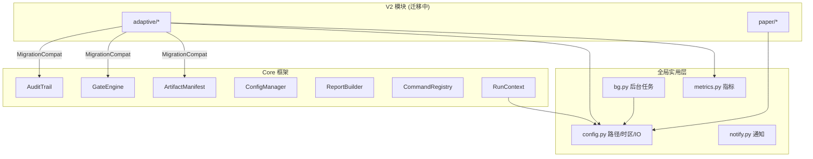

# Core Framework

# Core 框架 — 统一基础设施层

## 定位

Core 框架是 V2.14.2 重构产物，从分散在 `adaptive/`、`paper/` 等模块中的重复模式提取而来。它为整个因子实验室提供一套标准化的基础设施：审计日志、门禁检查、产物追踪、配置管理、报告生成和命令注册。

这些组件解决了此前每个模块独立实现相同逻辑的重复问题——`audit.log` 格式不统一、Gate 逻辑散落各处、HTML/CSV 报告各有各的模板。Core 框架将这些统一为 `AuditTrail`、`GateEngine`、`ReportBuilder` 等规范的类，V2 模块可通过 `MigrationCompat` 兼容层逐步迁移。



---

## 全局基础 (`commands/config.py`)

这是**全项目共用的配置层**，不限于因子实验室。提供：

| 用途 | 接口 |
|------|------|
| 时区 | `CST`（UTC+8）、`now_cst()`、`now_str()`、`ts_id()`、`date_id()` |
| 路径 | `BASE`（`~/.hermes/research-assistant`）、`PATHS` 字典（market / fundamentals / events / intraday / audit 等） |
| Windows 互通 | `INCOMING` 发布目录、`CODEX_READ_ONLY` 只读文件（持仓、推荐历史、标签、watchlist） |
| 环境变量 | `WECHAT_WEBHOOK_URL`、`RSSCAST_API_KEY`|
| 文件工具 | `safe_write_json()`（原子写入）、`append_jsonl()`、`read_csv_safe()`、`file_sha256()`、`file_rows()` |

`ensure_dirs()` 在 Hermes 启动时调用一次，确保所有数据目录存在。`safe_write_json()` 写入 `.tmp` 再 `replace`，避免写入中断导致文件损坏。

---

## Core 框架组件 (`factor_lab/core/`)

### AuditTrail — 统一审计日志

解决了"10+ 模块 audit.log 格式不统一"的问题。使用 JSONL 格式，每条记录包含 `event`、`run_id`、`module`、`action`、`status`、`message` 和 `safety` 块。

```python
trail = AuditTrail("/path/to/output")
trail.log(event="promotion_review", module="adaptive.paper_promotion_review",
          status="passed", safety={"no_live_trade": True, "auto_apply": False})
```

`safety` 块携带五面安全标记：`auto_apply`、`no_live_trade`、`broker_adapter_called`、`live_config_unchanged`、`paper_config_unchanged`。架构审计会扫描 safety 标记来评估安全边界完整性。

`get_events(limit=100)` 从尾部倒序读取，适合 Web 端点或 CLI 查询最近的审计事件。

---

### GateEngine — 统一门禁引擎

此前 risk/execution/data/config/audit gate 在多个模块中重复实现。`GateEngine` 统一为 checker-collector 模式：

```python
gate = GateEngine()
gate.add_check("risk", "max_position_size", passed=True, severity="blocker")
gate.add_check("risk", "daily_trade_limit", passed=False, severity="warning",
               message="今日已用 80% 额度")
gate.finalize()
gate.get_summary()
# → {"risk": {"verdict": "conditional_pass", "n_blockers": 0, "n_warnings": 1}}
```

`GateCheck` 有三个 severity 级别：
- **blocker** — 必须全部通过，否则 verdict = `fail`
- **warning** — 存在未通过的 warning 时 verdict = `conditional_pass`
- **info** — 不影响 verdict，仅记录

`GateResult` 提供快捷属性 `.blockers`、`.warnings`、`.passed`（= 无 blocker）。`adaptive/paper_promotion_review.py` 和 `adaptive/governed_dry_run.py` 已经使用此引擎。

---

### ArtifactManifest — 产物清单

每次运行的输出追踪：记录所有产出的文件路径、分类、MD5 哈希和文件大小，汇总为 `manifest.json`。

```python
manifest = ArtifactManifest("output_dir", run_id="20260707_120000")
manifest.add_input("/path/to/source.csv")
manifest.add_file("report.html", category="report")
manifest.add_file("audit.jsonl", category="audit")
manifest.write()
# → 写入 manifest.json，包含 input_hash、output_hash、files 列表
```

`input_hash` 和 `output_hash` 用于检测数据/代码是否变化，避免重复计算。`alpha/registry.py` 中的 `register_alpha()` 已调用 `manifest.write()`。

---

### ConfigManager — 配置管理

为需要"修改配置前先哈希快照"的场景设计：

```python
cm = ConfigManager()
snap = cm.snapshot({"param1": 0.5, "param2": "v2"})

# 修改后 diff
changes = cm.diff(snap["config"], {"param1": 0.6, "param2": "v2"})
# → [{"key": "param1", "before": 0.5, "after": 0.6}]

# 生成回滚补丁
rollback = cm.rollback_patch(snap["config"])
```

哈希使用 SHA256 截断到前 16 位（足够区分，易读）。`adaptive/paper_apply.py` 在写入前使用 `hash_config()` 检查配置是否意外变更。

---

### ReportBuilder — 统一报告

解决"几乎所有模块独立写 HTML"的重复问题。提供 HTML / CSV / Markdown 三种输出：

```python
rb = ReportBuilder("output_dir")
rb.add_section("IC Analysis", "mean_ic=0.038, icir=0.92")
rb.write_html("ic_report.html")    # 深色主题的 HTML
rb.write_csv("ic_detail.csv", [{"date": "...", "ic": 0.05}, ...])
rb.write_md("ic_summary.md", "## IC Summary\n...")
```

HTML 使用固定的深色主题（`background:#1a1a2e`、`color:#00bcd4`），与架构审计报告风格一致。

---

### CommandRegistry — 统一 CLI 命令注册

定义命令的结构化元数据：

```python
cmd = CommandDef(
    name="audit",
    handler="run_architecture_audit",
    description="运行架构审计",
    options=[CommandOption("--strict", type="bool", help="严格模式")],
    category="architecture",
)
registry = CommandRegistry()
registry.register(cmd)
registry.get("audit")  # → CommandDef
registry.list_by_category("architecture")
```

`COMMON_OPTIONS` 预定义了 `--latest`、`--run-id`、`--candidate`、`--start/--end/--last`、`--strict`、`--dry-run`、`--confirm`、`--rollback` 等通用参数，新模块不必重复定义相同的 CLI 接口。

---

### RunContext — 运行上下文

封装一次运行的参数合集，替代各模块自行维护的参数 dict：

```python
ctx = RunContext(
    run_id="20260707_120000",
    module="adaptive.governed_dry_run",
    candidate_name="ret5_v3",
    dry_run=True,
)
```

`PipelineStage` 和 `PipelineResult` 为多阶段流水线提供状态跟踪骨架，但目前模块内尚未全面使用。

---

### MigrationCompat — V2 兼容层

让 V2 模块在保留旧产物的同时输出 core 框架产物，实现渐进迁移：

```python
compat = MigrationCompat("output_dir", run_id, module="adaptive.shadow_forward")

# 基于现有逻辑运行...
compat.legacy("audit.log")                 # 标记旧产物
compat.add_core_output("manifest.json")    # 添加新产物
compat.log_event("shadow_run", status="passed")
compat.finalize(safety={"no_live_trade": True})
# → 同时输出 audit.log（旧）和 audit.jsonl（新）
```

从"compatible"状态到"native"状态的迁移条件：`RunContext` + `AuditTrail` + `ArtifactManifest` 三者俱全，且不再输出旧格式 audit.log。

---

## 周边工具

### 指标计算 (`factor_lab/metrics.py`)

**整个 Hermes 回测的 canonical 指标入口**。所有 `_quick_backtest` 和策略验证必须使用此模块而非自行计算。

| 函数 | 返回 |
|------|------|
| `calc_sharpe(returns, rf=0.03)` | 年化 Sharpe（无风险利率日化 252 分） |
| `calc_max_drawdown(equity)` | 最大回撤比率 |
| `calc_cagr(cum_ret, n_days)` | 年化收益率（252 交易日） |
| `calc_calmar(cagr, max_dd)` | Calmar 比率 |
| `compute_metrics(returns)` | 统一打包：累计收益/最大回撤/Sharpe/Calmar/CAGR/胜率/天数 |

`compute_metrics` 保证返回字段一致，供报告模板和前端 UI 消费。

---

### 数据契约 (`factor_lab/data_contract.py`)

V5.5 引入的"No-Fallback"策略：**NaN 必须抛异常，不能静默填充**。

```python
validate_series(series, "ret5")           # 有 NaN → 抛 DataContractViolation
validate_dataframe(df, ["close", "ret5"]) # 缺列或 NaN → 抛异常
safe_factor_calc(df, "ret5", ["close"], calc_fn)  # 验证 → 计算 → 再验证
```

与旧式 `df.fillna(0).pipe(calc)` 的区别：如果上游数据源出现问题，静默填充会掩盖问题，导致策略在错误数据上运行而不自知。契约模式让问题在源头暴露。

---

### 后台任务管理器 (`factor_lab/bg.py`)

Hermes 会话关闭后不会丢失的持久化后台任务：

```python
job_id = run_bg("python long_backtest.py", name="ret5-walkforward", timeout_minutes=120)
# → 返回 job_id，进程与会话解耦

list_jobs()      # 最近 20 个任务
job_status(jd)   # pid/status/exit_code
job_log(jd)      # 查看 stdout/stderr
kill_job(jd)     # SIGTERM → SIGKILL
clean_old_jobs() # 清理 7 天前的已结束任务
```

原理：`nohup bash -c "..."` + `preexec_fn=os.setpgrp` 使进程独立于终端会话组。使用 `subprocess.Popen` 生成监控子进程轮询 PID 存在性（`os.kill(pid, 0)`），任务结束后写入 `exit_code` 和 `finished_at`。

所有任务数据保存在 `~/.hermes/background-jobs/<job_id>/`，包含 `meta.json`、`stdout.log`、`stderr.log`。

---

### 企业微信通知 (`factor_lab/notify.py`)

长任务完成后推送通知到企业微信机器人：

```python
notify_goal_done("V1.7 策略验证", "ret5+close_gt_ma20 gate 全面超越基线")
```

发送包含状态图标（✅/❌/⚠️）、时间、摘要的 Markdown 消息。自动尝试从 `.bashrc` 读取 `WECHAT_WEBHOOK_URL`。`adaptive/version_notify.py` 的 `version_completed`/`version_blocked` 事件依赖此工具。

---

### 数据血缘 (`factor_lab/data_lineage/__init__.py`)

追踪数据文件的上下游关系，不做数据级 lineage（按文件粒度）：

```python
mf = create_manifest("tushare", "daily_kline", "data.csv", record_count=5000)
# → 写入 /mnt/d/HermesData/manifests/mf_20260707_*.json

link_lineage(child_id, parent_id)  # 记录父子关系
list_manifests(dataset="daily_kline")
get_manifest("mf_20260707_120000")
```

---

## 内部调用关系

核心依赖流向：所有模块依赖 `config.py`（路径/时区），`MigrationCompat` 聚合五个 core 子模块。`AuditTrail` 和 `ArtifactManifest` 被 `alpha/registry.py` 调用。

```
Metric consumers: strategy_validator, portfolio/metrics
Gate consumers: paper_promotion_review, governed_dry_run
Audit consumers: alpha/registry, V2 modules via MigrationCompat
```

## 测试覆盖

Core 框架的测试位于 `commands/tests/test_core_framework.py` 和 `commands/tests/test_migration_compat.py`，覆盖：

- `AuditTrail.get_events()` 读取与安全标记
- `GateEngine` blocker/warning/verdict 逻辑
- `ArtifactManifest` 的 add_file/write/hash 链路
- `ConfigManager` 的 hash/diff/snapshot
- `CommandRegistry` 的注册与查询
- `MigrationCompat` 的旧产物保留与新产物生成