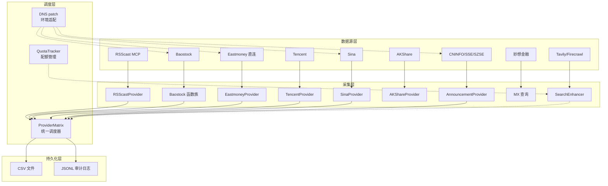

# Data Acquisition — commands

# 数据采集模块 (commands)

## 概述

数据采集模块是 Hermes 研究助手的**数据层入口**，负责从多个 A 股数据源获取行情、基本面、公告、政策事件及行业标签等原始数据。模块设计了**多源自动降级**架构：每个数据类型都有 2-4 个可替换的数据提供者，按优先级依次尝试，确保在任何一个数据源不可用时系统仍能正常工作。

该模块位于 `commands/` 目录下，由 14 个文件组成，约 2800 行 Python 代码。

## 数据源架构



**关键设计原则：免费无限量优先，付费备用。** 每个数据获取路径都有明确的优先级：

| 数据类型 | 主提供者 | 备用 1 | 备用 2 | 备用 3 |
|----------|----------|--------|--------|--------|
| 实时行情 | Eastmoney 直连 | RSScast MCP | Tencent | Sina |
| 日K线 | Tencent | RSScast MCP | Baostock | — |
| 基本面 | Baostock (免费无限量) | RSScast MCP | — | — |
| 全A快照 | AKShare spot | — | — | — |
| 公告 | CNINFO | SSE | SZSE | — |
| 行业分类 | Baostock (免费无限量) | 手动维护 | — | — |
| 搜索增强 | Tavily | Firecrawl | AnySearch | — |
| 宏观数据 | Baostock (免费无限量) | — | — | — |

## 核心组件

### 1. 统一调度器 — `ProviderMatrix`

`provider_matrix.py` 是数据获取的**唯一入口**。外部模块（如 IntradayMonitor、StockContext）不直接依赖任何具体数据源，而是通过 `ProviderMatrix` 实例调用数据：

```python
pm = get_provider()  # 单例
quotes = pm.get_quotes(["688012", "002371"])
kline = pm.get_kline(["688012"], "20260601", "20260702")
market = pm.get_full_market()
announcements = pm.get_announcements("688012")
```

`ProviderMatrix.get_quotes()` 内部按 `prefer` 参数选择提供者顺序（默认 `"eastmoney"`），遍历提供者列表直到有一个返回非空结果。如果所有提供者均失败，则写入审计日志并返回空字典。这种"遍历-捕获-继续"模式在 `get_kline()` 和 `get_quotes()` 中均有体现，确保在 Eastmoney WAF geo-block 或 RSScast MCP 超时等常见故障场景下仍能获取数据。

`ProviderMatrix` 聚合了 6 个具体提供者实例，各自实现 `get_quotes(codes)` 或 `get_kline(codes, start, end)` 接口，具备松耦合的可替换性。

### 2. RSScast MCP 客户端 — `rsscast_mcp.py`

通过 MCP (Model Context Protocol) 调用 RSScast A 股数据服务，是数据质量最高的付费数据源。所有接口函数遵循相同模式：

```python
def fetch_stock_prices(codes: list[str]) -> list[dict]:
    result = mcp_call("tools/call", {
        "name": "StockPriceQuery",
        "arguments": {"codes": codes},
    })
    text = extract_text(result)
    return parse_json_from_text(text)
```

核心函数 `mcp_call(method, params)` 构建 JSON-RPC 2.0 请求，通过 `urllib.request` 发送到 `https://app-cn.rsscast.io/api/mcp/v1/mcp`，使用 `RSSCAST_API_KEY` 环境变量认证。返回的 `extract_text()` 从 MCP 响应结构中提取 `result.content[0].text`，`parse_json_from_text()` 再从文本中定位 `[...]` JSON 数组并解析。

支持的 API 包括：
- `StockPriceQuery` — 实时行情（含涨跌幅、振幅、换手率）
- `StockKLineQuery` — 日K线（支持时间范围）
- `StockIndexPriceQuery` — 指数行情
- `StockIndexKLineQuery` — 指数日K线
- `StockOverviewQuery` — 公司基本面（营收构成、财务趋势、股息、股东）

此外，`fetch_sina_quotes()` 作为无 Key 依赖的备用实现，直接解析 Sina 的 hq.sinajs.cn HTTP 接口，用于无法访问 RSScast MCP 的场景。

### 3. Baostock 全量获取 — `baostock_data.py`

Baostock 是**免费无限量**的基础数据源，无月度配额限制。模块提供了 7 个独立的数据获取函数：

| 函数 | 输出文件 | 数据内容 |
|------|---------|---------|
| `fetch_profit_data()` | `fundamentals/profit_data.csv` | ROE、净利率、毛利率、净利润、EPS |
| `fetch_balance_data()` | `fundamentals/balance_data.csv` | 总资产、总负债、资产负债率、流动比率 |
| `fetch_cash_flow_data()` | `fundamentals/cash_flow_data.csv` | 经营/投资/筹资现金流 |
| `fetch_forecast_report()` | `fundamentals/forecast_report.csv` | 业绩预告类型与利润区间 |
| `fetch_adjust_factor()` | `market/adjust_factor.csv` | 复权因子与股息 |
| `fetch_stock_industry()` | `tags/stock_industry.csv` | 申万行业分类 |
| `fetch_index_constituents()` | `tags/index_membership.csv` | HS300/上证50/中证500 成分股 |

所有函数返回 `(records: int, errors: int)` 元组。每一条记录都包含 `pub_date` 和 `asof_date` 字段，用于防止未来函数（look-ahead bias）。

`run_all()` 函数串联全部数据获取流程，执行完毕后再调用 `build_fundamental_features()` 构建基本面因子评分（quality_score、growth_score、cashflow_score、balance_risk_score），供因子实验室使用。

`_read_symbols()` 从三个标签文件中自动收集需要关注的股票代码列表，无需硬编码。

### 4. 公告解析 — `announcement_parser.py` + `provider_matrix.py`

公告获取由 `AnnouncementProvider` 实现，合并三大交易所数据源：

- **CNINFO**（巨潮资讯）：POST JSON 请求到 `https://www.cninfo.com.cn/new/hisAnnouncement/query`，返回公告标题、日期、类型、附件 URL
- **SSE**（上交所）：GET 请求 `https://query.sse.com.cn/security/stock/queryCompanyBulletin.do`，返回 title/date/url
- **SZSE**（深交所）：POST JSON 到 `http://www.szse.cn/api/disc/announcement/annList`，返回 announcementTitle/announcementDate

`AnnouncementProvider.get_all(symbol)` 将三个源的结果合并为一个列表返回。

`AnnouncementParser` 在 `providers/announcement_parser.py` 中实现，使用 `EVENT_KEYWORDS` 字典将公告标题分类为 10 种事件类型：减持、监管函、重大合同、业绩预告、定增、并购、风险事项、分红、回购、股权激励。分类结果后续被 `PolicyEventFetcher` 用于构建盘前事件汇总。

### 5. 政策事件与搜索增强 — `policy_fetcher.py` + `search_enhancer.py`

`PolicyEventFetcher` 的工作流：

1. 从 `announcements_extracted.csv` 读取解析后的公告，筛选出减持、监管函、风险事项、业绩预告四类高影响事件
2. 调用 `build_preopen_events()` 将公告事件转化为统一格式的事件结构（含 impact_level 分类：high/medium/low）
3. 可选通过 Tavily API 搜索增强，补充外部新闻

`search_enhancer.py` 封装了三个搜索提供商：
- **TavilySearch** — 主要搜索源，支持 `topic="news"` 和 `days` 参数，用于近 7 天新闻搜索
- **FirecrawlSearch** — 备用，同时支持整页爬取（`scrape()`）和网页搜索（`search()`）
- **AnySearch** — 三级备用

所有搜索操作在请求前调用 `quota_check(provider)` 检查配额，避免意外超限。

### 6. 配额管理 — `quota.py`

`QuotaTracker` 管理付费 API（Tavily/Firecrawl/AnySearch）的月度配额：

```
每月总额度: 1000 次
每日安全限额: 45 次 (留10%余量)
```

配额文件位于 `data/audit/search_quota.json`，记录每个提供者的月度消耗、每日分布和被跳过的请求数。月初自动重置。`quota_check()` 返回 `False` 时调用方应跳过该请求，并由调用链记录 "quota_exhausted" 状态到审计日志。

### 7. DNS 修补 — `dns_patch.py`

Clash fake-ip 模式会将 Eastmoney、Baostock 等域名解析为 `198.18.x.x` 的虚拟 IP，导致连接失败。此模块在 socket 层注入 DNS 拦截：

```python
patch_all()  # 一次性修补所有 socket 解析函数
```

修补覆盖了三个 socket 函数：`getaddrinfo`、`gethostbyname`、`create_connection`。对于域名以 `.eastmoney.com` 或 `.baostock.com` 结尾的请求，通过 Cloudflare DNS over HTTPS (`https://cloudflare-dns.com/dns-query`) 获取真实 IP 地址，结果缓存在 `FAKE_IP_CACHE` 中。

模块在导入时自动检测：如果 `push2.eastmoney.com` 解析为 `198.18.x.x`，则自动调用 `patch_all()`。此外还会设置 `NO_PROXY` 环境变量绕过 Eastmoney/Baostock 的代理阻断，并清除 `ALL_PROXY` 全覆盖代理。

### 8. 标签维护 — `tag_maintainer.py`

手动维护的 A 股产业链标签系统，输出三个 CSV 文件：

- **`semiconductor_chain_tags.csv`** — 手动精选的 20 只半导体产业链股票，含产业链位置（设备/材料/设计/制造/封测/CPO）、子板块、产品描述
- **`stock_theme_tags.csv`** — 12 个主题标签（半导体设备、AI算力、CPO、华为链、国产替代等）→ 股票的映射关系
- **`industry_chain_tags.csv`** — 合并版，同时包含手动维护和 Baostock 获取的申万行业分类

`THEME_TAGS` 字典定义了主题标签到股票代码列表的映射，`TagMaintainer` 负责将扁平化结构写入 CSV，并在写入 industry_chain_tags 时通过 Baostock 补充官方行业分类。

`cmd_update_fundamentals()` 函数使用 Baostock 批量更新基本面数据（ROE、利润率等），作为 RSScast MCP 的免费替代方案写入 `financial_snapshot.csv`。

### 9. 东财直连 — `eastmoney_direct.py`

绕过 Eastmoney 主要端点的 WAF 限制，使用两个仍然可用的免费 API：

- **`EastmoneyProvider.get_quotes(codes)`** — 调用 `push2.eastmoney.com/api/qt/stock/get`，返回实时行情数据（价格、涨跌幅、成交量等）。`f170`/`f171` 字段为涨跌幅和涨跌额，需除以 100 得到百分比值。字段编号含义：`f43`=当前价、`f44`=最高、`f45`=最低、`f46`=开盘、`f47`=成交量、`f48`=成交额、`f57`=股票代码、`f58`=股票名称

- **`TencentProvider.get_kline(code, start, end)`** — 调用 `web.ifzq.gtimg.cn/appstock/app/fqkline/get`，返回日K线数据。内部通过 `_map_to_sina_prefix()` 将股票代码转为 prefix 格式（`sh688012`/`sz002371`）。K线数据按 `qfqday > day > hfqday` 优先级尝试

### 10. 妙想金融 — `mx.py`

妙想金融 API 入口，提供三个自然语言查询端点：

- `data` — 金融数据查询（如"雷赛智能主力资金流向"）
- `search` — 资讯搜索（如"雷赛智能 最新公告 2026"）
- `xuangu` — 智能选股（如"半导体板块 放量突破20日均线"）

三个端点的 API URL/字段名不同，通过 `field_map` 映射。结果格式化函数 `format_data()`、`format_search()`、`format_xuangu()` 各自处理不同的响应结构，并将字段编号（如 `f62`=主力净流入）转换为可读标签。

### 11. 资金流向 — `fund_flow.py`

通过 browser_navigator 模块控制浏览器，从东方财富资金流向页面提取个股和大盘的资金流向数据。个股页支持主力/超大单/大单/中单/小单的净流入和净占比。由于依赖浏览器执行，属于**降级使用**的数据获取方式，仅在 API 直接调用失败时作为备选。

## 数据流路径示例

以下是一个完整的"获取 688012 实时行情"的数据流：

```
hermes_cli.py: cmd_watch()
  → intraday_monitor.py: load_snapshot()
    → rsscast_mcp.py: fetch_stock_prices(["688012", ...])
      → rsscast_mcp.py: mcp_call("tools/call", {...})
        → JSON-RPC over HTTPS → RSScast API
      → rsscast_mcp.py: extract_text()
      → rsscast_mcp.py: parse_json_from_text()
    → (如果失败) fetch_sina_quotes()
      → urllib.request → hq.sinajs.cn
    → (如果失败) EastmoneyProvider.get_quotes()
      → urllib.request → push2.eastmoney.com
```

## 审计日志

所有数据获取操作统一通过 `append_jsonl()` 写入 `data/audit/fetch_log.jsonl`，每条记录包含：

```json
{
  "timestamp": "2026-07-07T14:30:00+08:00",
  "provider": "rsscast_mcp",
  "action": "get_quotes",
  "status": "ok",
  "records": 50,
  "symbols": ["688012", "002371", ...],
  "duration_ms": 234
}
```

`provider_matrix.py` 中的 `log_fetch()` 是统一的审计入口，所有提供者都通过它记录请求结果。`search_enhancer.py` 中的 `_log()` 和 `eastmoney_direct.py` 中的 `log()` 是各自的独立审计函数，但都写入同一个 JSONL 文件，保证审计日志的集中性。

## 错误处理策略

模块采用三层错误处理：

1. **Provider 级别** — 每个提供者方法捕获 `Exception`，写入审计日志后返回空结果。不向上传播异常，让调度器有机会尝试下一个提供者
2. **调度器级别** — `ProviderMatrix` 收集所有提供者的错误信息，如果全部失败则写入含 "all_failed" 状态的审计记录，返回空。调用方收到空结果而非异常
3. **调用方级别** — 如 `AnnouncementParser.parse_all()` 对每只股票单独包裹 `try/except`，一只股票失败不影响后续股票的处理。`MarketDataFetcher.update_live_snapshot()` 合并多个数据源的结果，即使部分源失败也能生成部分快照

DNS 解析失败（Clash fake-ip）通过 `dns_patch.py` 的导入时自动检测修复，**在 Provider 层以下**解决环境问题，对各数据采集模块透明。

## 与其他模块的连接

数据采集模块的输出是 CSV 文件，其他模块通过读取这些文件获取数据：

| 消费者模块 | 读取的数据文件 | 用途 |
|-----------|---------------|------|
| `factor_lab/scoring/fitness.py` | `fundamentals/profit_data.csv`, `balance_data.csv`, `cash_flow_data.csv` | 因子评分 |
| `factor_lab/alpha/industry_mapper.py` | `tags/stock_industry.csv` | 行业映射 |
| `commands/stock_context.py` | 调用 `search_enhancer.py` + `provider_matrix.py` | 构建股票上下文 |
| `commands/intraday_monitor.py` | 调用 `provider_matrix.py` 获取实时数据 | 盘中监控 |
| `commands/hermes_cli.py` | 调度各 `cmd_*` 函数 | CLI 入口 |

`config.py` 中的 `PATHS` 字典定义了所有数据文件的路径，确保模块间路径一致性。数据文件位于 `data/` 目录下的 `fundamentals/`、`tags/`、`market/`、`macro/`、`features/`、`audit/`、`events/` 子目录中。

## 扩展指南

若要添加新的数据源，需要：

1. 在 `provider_matrix.py` 中实现一个 Provider 类，包含 `get_quotes()`/`get_kline()` 方法
2. 在 `ProviderMatrix.__init__()` 中实例化并加入 `providers_order` 列表
3. 调用时使用 `log_fetch()` 写入审计日志

若要让新的提供者成为主提供者，将其在 `providers_order` 列表中排在第一位即可。所有消费者代码无需修改，因为它们通过 `ProviderMatrix` 统一访问数据。