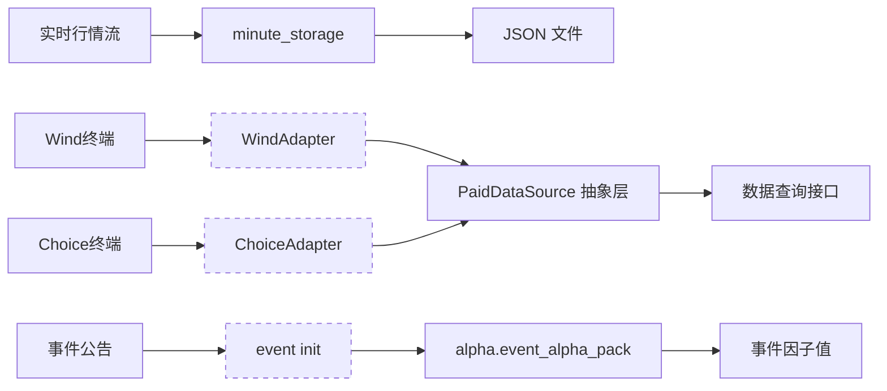

# Data Acquisition — factor_lab

# 数据采集模块 (`factor_lab`)

## 概述

数据采集模块是因子实验室的基础数据层，负责将原始市场数据转化为因子计算可消费的结构化数据。模块覆盖三条核心链路：

| 子系统 | 职责 | 数据形态 | 写入位置 |
|--------|------|----------|----------|
| **分钟线存储** (`minute_storage`) | 实时行情落地 | JSON 文件 | `/mnt/d/HermesData/minute_bars/` |
| **付费数据接口** (`paid_data`) | 第三方数据源抽象层 | `DataResponse` 对象 | 内存 |
| **事件因子** (`event`) | 公司事件因子计算 | α 因子值 | 下游因子管线 |

三条链路彼此独立，通过统一的数据目录和接口契约与流水线集成。

---

## 架构总览



数据采集模块本身不执行计算密集型加工，它的设计目标是：

- **对上游屏蔽数据源差异** — 因子引擎不关心数据来自 Wind、Choice 还是文件
- **对下游提供统一存取协议** — 分钟线写入/读取 API 对称，路径按 `{symbol}/{date}.json` 自动编排
- **为付费数据源预留扩展点** — 新增一个数据源只需实现 `PaidDataSource` 四个方法

---

## 分钟线存储 (`minute_storage`)

### 设计决策

选择 **文件系统 + JSON** 而非数据库，原因是：

1. 分钟线数据按股按日分片，天然形成 `symbol / date` 两级索引，文件系统已足够高效
2. 因子计算通常以天为粒度批量加载，文件 I/O 一次读取整日数据，无需游标分页
3. 无需维护数据库连接池，降低部署复杂度

### 核心函数

| 函数 | 签名 | 说明 |
|------|------|------|
| `store_minute_bars` | `(symbol, date_str, bars) → int` | 写入当日分钟线，返回 bar 数量 |
| `load_minute_bars` | `(symbol, date_str) → list[dict]` | 读取当日分钟线，缺失返回空列表 |
| `list_available_dates` | `(symbol) → list[str]` | 返回该股票所有有数据的日期（倒序） |

### 存储格式

```python
# 路径: /mnt/d/HermesData/minute_bars/000001.SZ/2026-07-07.json
{
  "symbol": "000001.SZ",
  "date": "2026-07-07",
  "bars": [
    {"time": "09:31", "open": 10.0, "high": 10.05, "low": 9.98, "close": 10.02, "volume": 123400},
    # ... 约 240 条（4 小时 × 60 分钟）
  ],
  "count": 240,
  "stored_at": "2026-07-07T15:01:23+08:00"
}
```

`bars` 内每个字典的结构由上游行情适配器保证，存储模块不做校验，仅做序列化和反序列化。

### 使用示例

```python
from factor_lab.minute_storage import store_minute_bars, load_minute_bars

# 写入
bars = fetch_realtime_bars("000001.SZ")  # 来自行情适配器
n = store_minute_bars("000001.SZ", "2026-07-07", bars)

# 读取
cached = load_minute_bars("000001.SZ", "2026-07-07")
if cached:
    print(f"命中缓存, {len(cached)} 条 k 线")
```

---

## 付费数据接口 (`paid_data`)

### 设计决策

使用 **抽象基类 + 数据类** 模式：

- `DataQuery` / `DataResponse` 定义跨数据源的统一数据契约
- `PaidDataSource` 定义四个必须实现的方法，保证任何数据源可被同一个消费者调用
- 缺省适配器返回 `error` 而非抛异常，方便上层做熔断降级

### 数据契约

```python
@dataclass
class DataQuery:
    symbol: str           # "000001.SZ"
    start_date: date      # 查询起始日
    end_date: date        # 查询结束日
    fields: list[str]     # 字段列表, None 表示全部
    frequency: str        # 频次: 1d / 1m / 5m / tick

@dataclass
class DataResponse:
    symbol: str           # 原样回传
    data: list[dict]      # 数据行
    total: int            # 行数
    source: str           # "wind" / "choice" / ...
    latency_ms: float     # 查询耗时
    error: Optional[str]  # 出错时填充错误描述
```

### 数据源接口

```python
class PaidDataSource(ABC):
    def connect(self) -> bool
    def query(self, q: DataQuery) -> DataResponse
    def available_fields(self) -> list[str]
    def status(self) -> dict
```

实现者需要保证 `query` 是幂等的——同一 `DataQuery` 多次调用应返回语义一致的结果。框架层会在重试时反复调用 `query`。

### 预留适配器

模块内置两个适配器，当前均为 **桩实现**（所有方法返回默认值），用于验证接入流程：

| 适配器 | 目标数据源 | 就绪条件 |
|--------|-----------|---------|
| `WindAdapter` | 万得 Wind 金融终端 | 安装 `WindPy` 并启动 Wind 客户端 |
| `ChoiceAdapter` | 东方财富 Choice 终端 | 安装 Choice 数据接口包 |

添加新的数据源：

```python
class JoinQuantAdapter(PaidDataSource):
    """聚宽数据源接入示例"""
    def connect(self) -> bool:
        # 实际连接逻辑
        return True

    def query(self, q: DataQuery) -> DataResponse:
        # 调用聚宽 API 并映射为 DataResponse
        ...

    def available_fields(self) -> list[str]:
        return ["open", "high", "low", "close", "volume", "amount"]

    def status(self) -> dict:
        return {"connected": True, "source": "joinquant", "quota_remaining": 5000}
```

---

## 事件因子 (`event`)

### 职责

`event/__init__.py` 是事件驱动因子模块的入口点。它所做的事情非常简洁：

1. 暴露 `factor_lab.alpha.event_alpha_pack` 中定义的所有公开符号
2. 覆盖四类公司事件对应的 α 信号

| 事件类型 | 对应因子方向 | 数据来源 |
|---------|------------|---------|
| 解禁 (unlocking) | 利空（供给冲击） | 上市公司公告 |
| 回购 (buyback) | 利好（信心信号） | 公司回购计划 |
| 分红 (dividend) | 中性偏多（除权后填权预期） | 权益分派公告 |
| 业绩预告 (earnings forecast) | 方向性（超预期/低于预期） | 业绩预告/快报 |

### 使用方式

```python
from factor_lab.event import compute_unlocking_alpha, compute_buyback_alpha

# 事件因子在因子工厂中与其他 alpha 信号混合
factors = {
    "unlocking": compute_unlocking_alpha(stock_pool, date),
    "buyback":   compute_buyback_alpha(stock_pool, date),
}
```

具体因子计算逻辑实现在 `event_alpha_pack` 中，本层只做包的重新导出。

---

## 与因子流水线的集成

三条数据采集链路进入因子加工管线的位置不同：

```
行情流 → minute_storage → [日内 / 日频 alpha] → ...
                                                      ↓
Wind/Choice → paid_data   → [基础价量因子]     → 因子矩阵 → 选股 → 回测
                                                      ↑
事件公告 → event_alpha   → [事件因子]           → ...
```

- **分钟线** 被日内 α 计算器消费，生成高频信号
- **付费数据** 被基础价量因子模块消费，生成日频因子值
- **事件因子** 作为独立的 α 信号模块，在因子合成阶段与其他因子混合

---

## 扩展指南

### 新增分钟线数据源

分钟线存储层与数据源解耦——只需将数据格式化为 `list[dict]` 传入 `store_minute_bars`，存储层不关心数据来源是：

- 实时行情 WebSocket
- 盘后批处理文件
- 第三方数据 API

### 新增付费数据源

三步完成：

1. 继承 `PaidDataSource` 并实现四个抽象方法
2. 在工厂函数中注册新适配器
3. 调用方通过 `DataSourceRegistry` 按名称获取实例（见 V5.0 Data Source Registry）

### 新增事件因子

1. 在 `event_alpha_pack` 中实现因子计算函数
2. 在 `event/__init__.py` 中导出（当前使用 `*` 导入，自动继承）
3. 在因子合成阶段为新因子分配权重

---

## 注意事项

- **时区**：分钟线时间戳使用东八区（CST, UTC+8），存储时显式转换 `datetime.now(CST)`
- **文件冲突**：`store_minute_bars` 直接覆盖已有文件——并发写入同一天同一只股票是竞态，上层调用方需保证单线程写入
- **错误模式**：`PaidDataSource.query` 出错时不会抛异常，而是填充 `response.error`。调用方应检查此字段后决定是否重试或降级
- **数据量估算**：单股单日分钟线约 240 条，每条约 200 B JSON，约 50 KB/股/日，A 股 5000 只全量约 250 MB/日