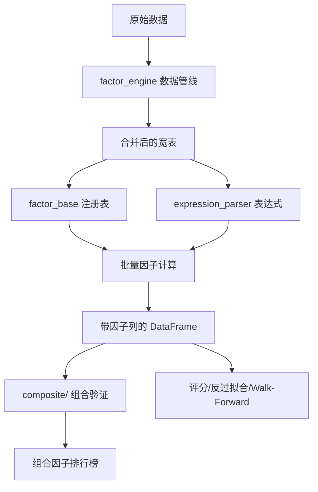
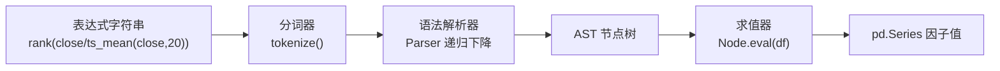

# Factor Engine

以下是 Factor Engine 模块的技术文档。

---

# Factor Engine 模块 — 因子计算引擎

## 概述

Factor Engine 是 Hermes Research Assistant 的量化因子计算核心，负责从原始市场数据到可用因子的全链路处理。它解决了三个核心问题：

1. **因子定义与注册** — 声明式注册表管理 100+ 内置因子，按功能类目组织
2. **多源数据融合** — 统一加载 K 线、基本面、资金流、北向、两融、事件、新闻情绪等异构数据源，时间对齐
3. **表达式因子** — 提供 AST 解析器 V2，支持用类 SQL 表达式（含 42+ 算子）动态定义因子

模块位于 `commands/factor_lab/`，由以下子模块构成：

| 模块 | 职责 |
|------|------|
| `factor_base.py` | 因子注册表（声明式 `@register`）、内置因子实现 |
| `factor_engine.py` | 数据加载管线、多源合并、批量因子计算入口 |
| `expression_parser.py` | 表达式解析器 V2，递归下降 AST + 算子注册表 |
| `composite/` | 组合因子合成器、相关性分析、批量验证框架 |



---

## 因子注册表（`factor_base.py`）

### 声明式注册

整个系统采用装饰器驱动的注册模式。任何函数只要标注 `@register`，即自动加入全局 `REGISTRY` 列表：

```python
@register("ret5", "momentum", {"window": 5}, "5日收益率动量")
@register("ret10", "momentum", {"window": 10}, "10日收益率动量")
def ret_n(df, window=20):
    return df.groupby("symbol")["close"].transform(lambda x: x.pct_change(window))
```

同一函数可以用多次 `@register` 绑定不同参数，实现"一个实现，多因子注册"——例如 `ret_n` 一次注册了 `ret5`、`ret10`、`ret20`、`ret60` 四个动量因子。

### 注册表结构

每条注册记录是一个 dict：

```python
{
    "name": "ret5",
    "category": "momentum",
    "func": <函数引用>,
    "params": {"window": 5},
    "description": "5日收益率动量",
}
```

`list_factors(category)` 按类目检索，也会加载 `evolved_candidates.json` 中的 LLM 进化因子（通过 `_load_evolved()`）。

### 内置因子分类体系

共 **12 大类别，80+ 因子**：

| 类目 | 示例因子 | 数量 |
|------|----------|------|
| `momentum` | ret5/10/20/60, ret_std, max_high60, min_low60 | ~6 |
| `trend` | ma5_gt_ma10, close_gt_ma20, ts_regression_slope20 | ~5 |
| `volume` | vol_ratio5/20/60, vol_price_corr, turnover20 | ~5 |
| `volatility` | atr20, volatility20/60, downside_vol, intraday_range | ~5 |
| `reversal` | reversal5, reversal20 | ~2 |
| `liquidity` | amihud_illiquidity20, amount_rank, low_liquidity_penalty | ~7 |
| `breakout` | high_20_breakout, close_to_high20/60 | ~6 |
| `pullback` | pullback_5/10_in_ma20_uptrend, low_volume_pullback | ~4 |
| `ret5_filter` | ret5_penalty_volatility20, ret5_penalty_gap 等 6 种惩罚 | ~6 |
| `quality` | roe_q, gross_margin_q, debt_ratio_q, quality_composite | ~6 |
| `fund_flow` | net_inflow_1d/5d, flow_divergence, consecutive_inflow 等 | ~10 |
| `north_bound` | nb_net_flow_1d/5d, nb_holding_change, nb_flow_momentum | ~7 |
| `margin` | margin_buy_ratio, margin_net_buy, margin_flow_momentum 等 | ~8 |
| `sentiment` | sentiment_1d/5d, sentiment_mom | ~3 |
| `technical` | macd_dif/dea/histogram/cross, kdj_k/d/j/cross, boll_* | ~12 |
| `industry_relative` | ret5_industry_adj, industry_neutral_quality/composite 等 | ~10 |
| `event` | lockup_expiry, buyback_signal, forecast_upgrade, event_composite | ~10 |
| `evolved` | LLM 进化因子（从 JSON 动态加载） | 运行时 |

每个因子函数的签名统一为 `func(df: pd.DataFrame, **params) -> pd.Series`，保证可组合性。

### 进化因子（Evolved Factors）

`evolved_candidates.json` 中的 LLM 生成因子在 `list_factors()` 或 `compute_all()` 时自动加载。系统会在第一轮计算完所有基础因子后，将因子列注入 DataFrame，再专门计算依赖这些列的进化因子——对应 `compute_all()` 中的两阶段策略。

---

## 因子计算引擎（`factor_engine.py`）

### 数据加载管线

`load_stock_kline()` 是全局入口，单次调用完成全部异构数据源的加载与时间对齐：

```python
df = load_stock_kline(symbols, start_date, end_date, min_days=60)
```

内部流程：

```
K 线 CSV（按 symbol 读取） ─┐
                             ├─→ DataFrame（date × symbol 长表）
基本面 as-of merge ─────────┘
                              ↓
日频左连接（symbol + date） ← 资金流向
                             ← 北向资金
                             ← 两融数据
                             ← 综合事件
                             ← 新闻情绪
                              ↓
                          DataFrame（全字段）
```

### 关键设计决策

**基本面使用 `merge_asof` 做 as-of 合并**（`merge_fundamentals`）：按 `pub_date` 向后查找最近一期已披露财报，防止未来函数。其他日频数据使用标准 `left join on (symbol, date)`，缺失值统一填充 0。

```python
merged = pd.merge_asof(
    grp.sort_values("date"),
    sym_fund[["pub_date"] + FUND_FIELDS].sort_values("pub_date"),
    left_on="date", right_on="pub_date",
    direction="backward",  # 只使用已发布的财报
)
```

### 批量因子计算

`compute_all(kline_df)` 是批量计算入口，两阶段执行：

1. **第一阶段**：遍历 `REGISTRY`，计算所有非 `evolved` 类别的因子。失败时填充 NaN 而非抛出异常。
2. **第二阶段**：将第一阶段的结果加入 DataFrame，再计算 `evolved` 类别的表达式因子（这些因子依赖其他因子列作为输入）。

返回的 DataFrame 包含 `date`、`symbol`、`close`、`ret1` 和所有因子列。

---

## 表达式解析器 V2（`expression_parser.py`）

### 架构

解析器使用经典的**递归下降解析 + AST 求值**模式，分为三层：



### 优先级与文法

支持 6 级优先级（从低到高）：

| 优先级 | 文法规则 | 结合性 | 示例 |
|--------|----------|--------|------|
| 1 | `or_expr` ← `and_expr` (或 `\|\|`) | 左结合 | `A or B` |
| 2 | `and_expr` ← `comparison` (与 `&&`) | 左结合 | `A and B` |
| 3 | `comparison` ← `additive` (`> < >= <= == !=`) | 左结合 | `close > ma20` |
| 4 | `additive` ← `multiplicative` (`+ -`) | 左结合 | `ret5 - ret10` |
| 5 | `multiplicative` ← `power` (`* /`) | 左结合 | `ret5 * rank(vol)` |
| 6 | `power` ← `unary` (`^`) | **右结合** | `returns ^ 2` |

### 算子注册表（FUNC_REGISTRY）

42+ 算子分六大类：

| 类别 | 算子 | 数量 |
|------|------|------|
| 截面算子 | `rank`, `zscore`, `scale` | 3 |
| 时序算子 | `ts_mean`, `ts_std`, `ts_min`, `ts_max`, `ts_sum`, `ts_rank`, `ts_delta`, `ts_av_diff`, `ts_decay_linear`, `ts_corr`, `ts_cov` | 11 |
| V2 新增时序 | `ts_shift`, `ts_argmax`, `ts_argmin`, `ts_product`, `ts_zscore` | 5 |
| 技术指标 | `ema`, `sma`, `rsi`, `bb_width`, `boll_upper/lower/mid` | 7 |
| 辅助算子 | `abs`, `sign`, `sigmoid`, `tanh`, `clip`, `where`, `sign_power`, `log` | 8 |
| V2 新增一元/二元 | `power`, `sqrt`, `exp`, `max`, `min` | 5 |

**别名系统**：常见缩写自动映射到标准算子，如 `delta → ts_delta`、`delay → ts_shift`、`stddev → ts_std`、`pow → power`。别名在模块加载时通过 `_setup_aliases()` 建立。

### 求值模型

每个因子算子通过 `_cs_apply`（截面）或 `_ts_apply`（时序）与 DataFrame 交互：

- **截面算子**：`val.groupby(df["date"]).transform(fn)` — 每日截面独立处理
- **时序算子**：`val.groupby(df["symbol"]).transform(fn)` — 每只股票独立处理

时序算子的窗口参数通过 `_get_window` 统一解析，窗口缺失时用默认值 20。

### 用法

```python
parser = ExpressionParser()
node = parser.parse("rank(close / ts_mean(close, 20))")
result = node.eval(df)  # → pd.Series

# 一步到位
result = parser.eval("ts_zscore(returns, 20) < -2", df)

# 验证（无 DataFrame 也可）
err = parser.validate("where(close > ma20 and volume > ts_mean(volume,20), 1, 0)")
```

---

## 组合因子系统（`composite/`）

### 组合因子合成器（`factor_combiner.py`）

五种合成方法，输入为多个基础因子，输出为单个复合因子：

| 方法 | 逻辑 |
|------|------|
| `equal_weight_score` | 每个因子每日截面 rank 后等权平均 |
| `weighted_score` | 每个因子 rank 后按指定权重求和 |
| `gated_score` | 主因子 rank > 0.5 时才取次因子 rank，否则为 0 |
| `zscore_blend` | 每日截面 zscore 标准化后加权 |
| `rank_blend` | 同 `weighted_score`（每日 rank 归一化后加权） |

```python
composite = compute_composite(
    factor_df, ["ret5", "vol_ratio60"],
    method="gated_score",
)
```

### 因子相关性分析（`factor_correlation.py`）

两套互补指标评估因子之间的冗余度：

**`compute_correlation`** — Pearson 和 Spearman 相关系数矩阵（截面去均值后计算）。`avg_corr` 报告全矩阵上三角绝对值均值，衡量整体冗余度。
**`compute_topn_overlap`** — Top N 股票集合的 Jaccard 相似度。对最近最多 10 个交易日，取每个因子排名前 `top_quantile` 的股票集合，Jaccard 均值反映选股重合度。

### 组合验证框架（`composite_validator.py`）

提供两条验证路径：

**单组合验证 `run_composite_validation`**：对一个组合因子执行完整验证管线——计算因子值 → 反过拟合 → Walk-Forward → 家族分类 → 评分。输出包含每个环节的详细结果。

**批量验证 `validate_composites_batch`**：对 5 种组合方法 × 多组基础因子进行全排列验证。从 `factor_leaderboard.json` 加载候选池，共享数据避免重复加载，自动生成：
- JSON 排行榜（`composite_leaderboard.json`）
- CSV 排行表
- HTML 可视化报告
- Markdown 推荐/淘汰报告
- 因子相关性与 TopN 重合度分析
- 审计日志（`audit.log`）
- 数据限制警告（`limitation_warnings.log`）

```python
batch = validate_composites_batch(
    leaderboard_path="/mnt/d/HermesReports/factor_leaderboard/xxx/xxx.json",
    combine_methods=["equal_weight_score", "weighted_score", "gated_score"],
)
```

验证结果按评分降序排列，A/B 级且通过门禁的组合自动标记为 `promoted`。数据不足时不会静默降级——`limitation` 字段明确标记 `insufficient_data` 或 `limited`。

---

## 数据限制与安全策略

在整个因子引擎中，数据不足不会导致静默失败：

- 基本面、资金流等辅助数据缺失时返回空 DataFrame，管线自动跳过该数据源的合并
- `compute_all` 中单个因子计算失败只返回 NaN，不影响其他因子
- `validate_composites_batch` 在有效数据不足 200 行时抛出 `ValueError`
- 组合验证的基础因子不足 2 个时拒绝执行
- 组合因子名唯一编码了成分因子和合成方法（如 `ret5_vol_ratio60_gated`），便于追溯

---

## 调用关系与外部分界

### 本模块提供的服务

| 消费者 | 使用方式 |
|--------|----------|
| MCP Server (`mcp_server.py`) | `ExpressionParser.validate()` 验证 LLM 生成的因子表达式 |
| 研究循环 (`research_loop.py`) | 表达式验证 + `compute_all` 批量计算 |
| 评分管线 (`scoring/`) | `list_factors()` 查询注册表；`compute_factor()` 计算单个因子 |
| 组合验证入口 (`validate_composites.py`) | `validate_composites_batch` + `compute_correlation` |
| 信号生成器 (`live/signal_generator.py`) | `load_stock_kline()` 加载实时数据 |

### 本模块调用的外部服务

- `strategy_lab/universe.py::build()` — 获取股票池（`validate_composites_batch` 中选股）
- `factor_lab/validation/anti_overfit.py::run_anti_overfit()` — 反过拟合验证
- `factor_lab/validation/rolling_validator.py::run_rolling_validation()` — Walk-Forward 验证
- `factor_lab/scoring/factor_score.py::score_factor()` — 因子评分
- `factor_lab/scoring/factor_family.py::classify_factor()` — 家族分类
- `factor_lab/pool/candidate_pool.py::load_from_leaderboard()` — 候选池加载