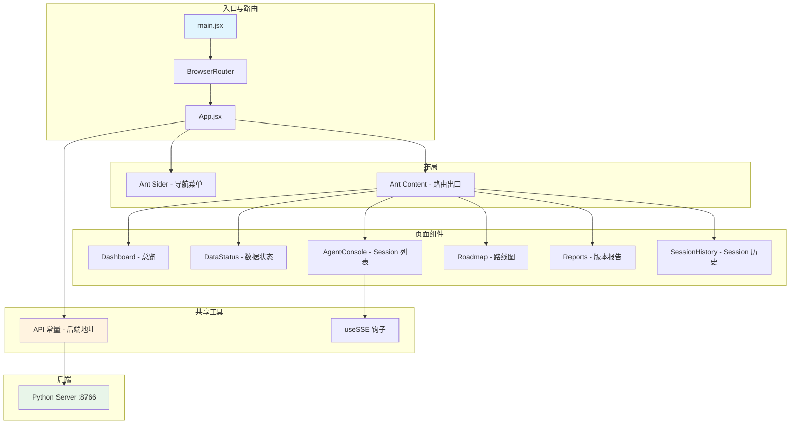

# Frontend

# 前端监控面板 (Frontend Dashboard)

## 概述

前端模块是 Hermes Research Assistant 的浏览器端监控面板，提供量化策略研发流程的可视化界面。基于 **React 18** + **Vite** + **Ant Design 5** 构建，通过 REST API 与后端 Python 服务器通信，以轮询方式实时呈现版本路线图、Agent Session、数据健康状态和版本报告。

## 架构概览



## 组件结构

### 入口与路由

**`src/main.jsx`** — 应用入口。使用 `createRoot` 挂载 React 18 Concurrent Mode，包裹 `StrictMode` 和 `BrowserRouter` 提供客户端路由。所有路由定义集中在 `App.jsx` 中，未匹配路径统一重定向到 `/`。

```jsx
// main.jsx — 挂载点
createRoot(document.getElementById('root')).render(
  <StrictMode>
    <BrowserRouter>
      <App />
    </BrowserRouter>
  </StrictMode>,
)
```

### 应用骨架 `App.jsx`

核心职责：

1. **导出 API 基地址常量** — `const API = 'http://127.0.0.1:8766'`，所有页面通过 `import { API } from '../App'` 引用，保证后端地址单点维护。
2. **左侧导航 Sider** — 深色主题（`#0F172A`），6 个菜单项，支持折叠。每个菜单项使用 `NavLink` 实现激活态高亮。
3. **路由配置** — 6 条路由分别映射到对应页面组件。

```jsx
const MENU = [
  { key: '/', icon: <DashboardOutlined />, label: <NavLink to="/" end>总览</NavLink> },
  { key: '/data', icon: <DatabaseOutlined />, label: <NavLink to="/data">数据状态</NavLink> },
  { key: '/console', icon: <RobotOutlined />, label: <NavLink to="/console">Agent Console</NavLink> },
  { key: '/roadmap', icon: <ForkOutlined />, label: <NavLink to="/roadmap">路线图</NavLink> },
  { key: '/reports', icon: <FileTextOutlined />, label: <NavLink to="/reports">版本报告</NavLink> },
  { key: '/history', icon: <HistoryOutlined />, label: <NavLink to="/history">Session 历史</NavLink> },
]
```

### 共享自定义 Hook `useSSE.js`

用于服务端推送事件的 React Hook，封装了 `EventSource` 的生命周期管理：

| 参数 | 默认值 | 说明 |
|------|--------|------|
| `url` | — | SSE 端点地址 |
| `events` | `['message']` | 监听的事件类型列表 |
| `autoConnect` | `true` | 是否在挂载时自动连接 |
| `reconnectDelay` | `3000` | 重连基础延迟（指数退避，上限 5 倍） |
| `maxRetries` | `Infinity` | 最大重连次数 |
| `withCredentials` | `false` | EventSource 的 credentials 标识 |

返回 `{ data, error, isConnected, connect, disconnect }`，组件可通过 `data` 获取最新事件负载，通过 `isConnected` 判断连接状态。

**设计要点：**
- 自动解析 JSON 数据，解析失败时保留原始字符串
- 每次收到事件时，将上一次数据以 `previous` 字段保留，便于增量比较
- 组件卸载时自动断开连接，避免内存泄漏
- 指数退避策略：`delay × min(retryCount, 5)`，防止频繁重连

### 页面组件

#### Dashboard（总览）

数据源：`GET /api/status`，每 5 秒轮询。

四个统计卡片：当前版本、已完成数、失败数、Lock 状态。版本表格支持点击展开详情 Modal，Modal 内显示版本元信息（版本号、状态、自动允许、交易模式）和关联 Agent 的开发输出（通过 `agent-console` API 逆向匹配 Session）。

**关键逻辑：** `showDetail` 函数通过 `API/agent-console/sessions?limit=200` 搜索包含当前版本号关键词的 Session，通过字符串包含匹配（`s.prompt?.includes(v.version)`）实现关联。

#### DataStatus（数据状态）

数据源：5 个独立端点，通过 `Promise.all` 并行加载。

| 端点 | 用途 |
|------|------|
| `/api/data/overview` | 总览摘要（总数/健康/降级/失败/待检/阻塞） |
| `/api/data/providers` | 数据提供者健康详情 |
| `/api/data/freshness` | 数据文件新鲜度 |
| `/api/data/gaps` | 数据缺口报告 |
| `/api/data/fetch-log?limit=100` | 最近拉取日志 |

**设计特点：**
- 定期轮询间隔 30 秒，适合监控场景的高延迟容忍
- 提供者表格支持展开行，显示近期错误记录
- 新鲜度表使用进度条直观展示数据延迟与阈值的比例
- 提供全局刷新按钮和自动刷新

#### AgentConsole（Session 控制台）

数据源：`GET /api/agent-console/sessions?limit=50`，每 5 秒轮询。

左侧 Session 表格显示最近 50 条记录，选择某条后右侧展开详情面板，包含 Prompts、Agent 回答（Markdown 渲染）、诊断日志等。`answerRef` 用于在回答更新时自动滚动到底部。

**UI 特点：**
- Agent 名使用彩色标签区分（`claude_code` → 蓝色，`hermes_auto` → 紫色，其他 → 绿色）
- Session 状态标签支持 `completed`（绿色）、`running`（旋转蓝色）、其他（灰色）
- 诊断日志折叠在 `<details>` 中，不占用默认视口

#### Roadmap（路线图）

数据源：`GET /api/roadmap/versions`。

版本规划页面，支持手动标记版本状态（完成/失败）。**暗色主题风格**（`#121a35` 背景），与面板其他页面的亮色主题形成视觉对比，突出路线图的"规划"属性。

**交互：**
- 每行提供"完成"和"失败"两个操作按钮
- 点击版本行打开详情 Modal，展示所有元字段
- 自动跳过已完成的版本（操作按钮不出现在已完成版本上）

#### Reports（版本报告）

数据源：`GET /api/versions/report/detail` + Session 列表 + 备份列表。

版本完成报告的详细视图，包含：
1. 统计卡片（当前版本/已完成数/失败数）
2. 版本完成列表，点击展开详情 Modal
3. **Git 提交记录和文件变更列表**（直接从后端获取）
4. Session 管理表格，支持一键备份

#### SessionHistory（Session 历史）

数据源：`GET /api/agent-console/sessions?limit=100` + `/api/agent-console/backups`。

Session 的完整生命周期管理：浏览、查看详情、备份、恢复。备份和恢复操作通过 `POST` 端点实现，操作后自动刷新列表。

## 数据流

### 数据获取模式

| 模式 | 位置 | 描述 |
|------|------|------|
| 定时轮询 | Dashboard (5s), AgentConsole (5s), DataStatus (30s) | `setInterval` + `fetch`，刷新时保留当前选中状态 |
| 手动刷新 | 所有页面 | 刷新按钮，调用 `load()` 函数 |
| 加载时获取 | 所有页面 | `useEffect` 挂载时首次加载 |
| Promise 并发 | DataStatus | `Promise.all` 并行加载 5 个数据端点 |

### API 调用链路

```
前端组件 → fetch(`${API}/api/...`) → Vite proxy (开发) / 直连 (生产) → Python Server :8766
```

- Vite 开发服务器在 `vite.config.js` 中配置了 `/api` 代理：`target: 'http://127.0.0.1:8766'`
- 生产构建后需由反向代理（如 Nginx）处理 `/api` 路由

### Session 关联机制

Dashboard 和 Reports 在查看版本详情时，会尝试通过字符串匹配（`s.prompt?.includes(v.version)`）查找关联的 Agent Session。这是一种松耦合的关联策略，不要求后端维护显式的外键关系。

## 设计系统

`src/index.css` 定义了完整的**亮色主题设计系统**：

| Token | 值 | 用途 |
|-------|-----|------|
| `--bg-page` | `#F8FAFC` | 页面背景 |
| `--bg-surface` | `#FFFFFF` | 卡片/表面背景 |
| `--accent` | `#2563EB` | 品牌色（蓝色） |
| `--success` | `#059669` | 成功状态 |
| `--warning` | `#D97706` | 警告状态 |
| `--error` | `#DC2626` | 错误状态 |
| `--text-primary` | `#0F172A` | 主要文字 |
| `--text-secondary` | `#64748B` | 次要文字 |

**CSS class 体系：**
- `.card` / `.card-header` — 通用卡片
- `.stat-card` / `.stat-card.ok\|warn\|err` — 统计卡片（左边框颜色）
- `.badge` / `.badge-ok\|warn\|err\|info` — 标签
- `.progress-bar` / `.progress-bar-fill` — 进度条
- `.status-dot.running\|idle\|error` — 状态原点
- `.markdown-body` — Markdown 渲染样式

同时提供了 **Ant Design 组件覆盖**（`.ant-table`/`.ant-card`/`.ant-statistic` 等），确保 Ant Design 组件与自定义设计系统视觉一致。

## 路由关系

```
+-- /                  Dashboard（总览）
+-- /data              DataStatus（数据状态）
+-- /console           AgentConsole（Agent Session）
+-- /roadmap           Roadmap（路线图）
+-- /reports           Reports（版本报告）
+-- /history           SessionHistory（Session 历史）
+-- *                  重定向到 /
```

## 开发与构建

```bash
# 开发模式
cd commands/frontend
npm run dev     # 启动 Vite 开发服务器 :5173，自动代理 /api 到 :8766

# 生产构建
npm run build   # 输出到 dist/ 目录，部署时需配置后端静态文件服务
```

**关键依赖：**
- `react` / `react-dom` — 框架核心
- `react-router-dom` — 客户端路由
- `antd` / `@ant-design/icons` — UI 组件库
- `react-markdown` / `remark-gfm` — Markdown 渲染（支持 GFM 表格/任务列表等）