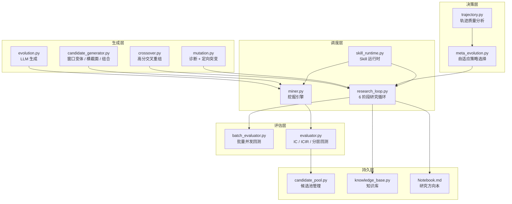
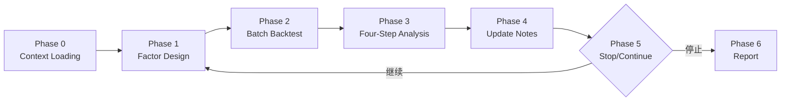
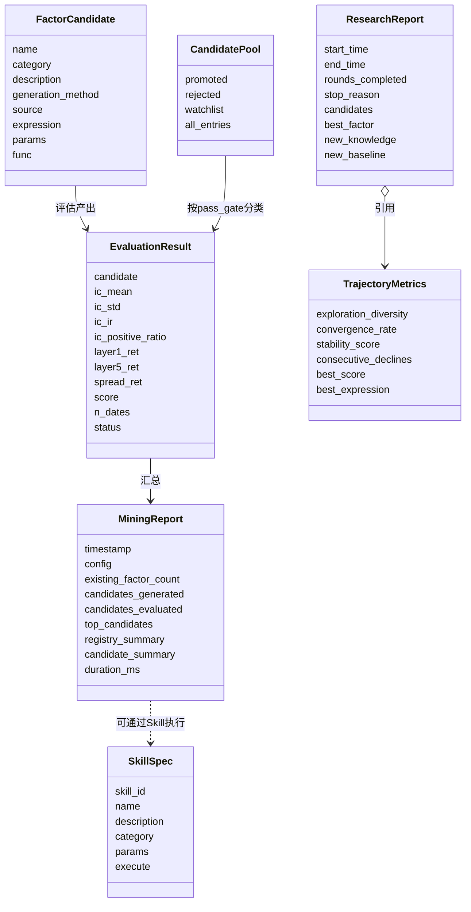

# Research System

# Research System — 量化因子研究与自动发现系统

## 系统概述

Research System 是一个面向 A 股量化研究的**因子自动发现与迭代优化系统**。它集成了多种因子生成策略（LLM 驱动、数据驱动、交叉重组、定向突变），配合快速评估流水线和自适应进化策略选择，构成了一个能够在无人干预下持续生成、验证、优化因子的研究闭环。

系统覆盖从**候选生成 → 快速评估 → 结果分析 → 知识沉淀**的完整链路，支持 CLI、编程 API、和 Research Skill 三种接入方式。

---

## 架构总览



---

## 核心模块

### 1. 因子挖掘引擎 — `factor_mining/`

#### CandidateGenerator — 三路候选生成

`factor_mining/candidate_generator.py` 提供三种正交的生成策略，通过 `CandidateGenerator.generate_all()` 统一组装：

| 策略 | 类 | 产出 |
|------|----|------|
| 窗口变体 | `WindowVariationGenerator` | 对 ret/vol_ratio/ret_std/ma_gap/close_gt_ma 模式生成新窗口参数组合 |
| 横截面变体 | `CrossSectionalGenerator` | 对已有因子追加 `_rank` / `_zscore` 截面标准化 |
| 因子组合 | `CombinationGenerator` | 两两因子的加法、减法、乘法组合 |

每个生成策略都检查 `existing_registry`，跳过已注册的因子名。`FactorCandidate` 数据类承载候选定义，包含 `func` 回调函数供评估器直接调用。

关键设计：`WindowVariationGenerator.PATTERNS` 以声明式列表定义模式模板，每个模板描述前缀、分类、窗口列表、已有窗口集合。新增模式只需追加一条记录。

#### CandidateEvaluator — 评估流水线

`factor_mining/evaluator.py` 对候选执行四步评估：

1. **因子值计算** — 调用候选的 `func(df)` 计算信号列
2. **RankIC** — 逐日 Spearman 相关，输出均值/标准差/ICIR/正比例
3. **分层回测** — `pd.cut` 等分 5 层，计算各层平均收益及多空差
4. **综合评分** — `|IC|×10 + |ICIR| + |spread|×100`

评估结果按评分降序排列。`quick_evaluate()` 提供快捷入口。

#### FactorMiningEngine — 挖掘编排

`factor_mining/miner.py` 的 `FactorMiningEngine.mine()` 编排完整流程：

1. 从 `factor_base` 加载已有因子注册表
2. 调用 `CandidateGenerator.generate_all()` 生成候选
3. 调用 `CandidateEvaluator.evaluate()` 批量评估
4. 封装为 `MiningReport`（含分类统计、Top-N 排序、耗时）

`register_top_candidates()` 支持将评估通过的候选注册到 `factor_base.REGISTRY`。

```python
# 典型用法
engine = FactorMiningEngine()
report = engine.mine(df=klines_df)
report.print_summary()
engine.register_top_candidates(report, top_n=5)
```

---

### 2. 研究循环 — `research_loop.py` / `research_loop/`

研究循环是一个六阶段自动迭代过程，每个循环由 LLM 驱动、轨迹质量反馈控制。

#### ResearchLoop.run() — 六阶段流程



**Phase 0 — Context Loading：** 从研究笔记本（Markdown）解析当前 baseline、已完成实验、待探索方向；从知识库加载 rules / findings / failures。

**Phase 1 — Factor Design：** 构造包含 baseline、已知规则、待探索方向、已证伪路径的 prompt，调用 LLM 生成 3 个因子表达式。`_validate_expression` 通过 `ExpressionParser` 做语法验证；`_normalize_expr` 查重。

**Phase 2 — Batch Backtest：** 为每个候选调用 `_evaluate_single()` 计算评分 / IC / ICIR。当前实现占位模拟，预留集成真实回测的接口。

**Phase 3 — Four-Step Analysis：**
- Step 1: Fact Collection — 收集回测事实数据
- Step 2: Independent Judgment — 主模型 LLM 独立判断
- Step 3: Cross-Review — 第二模型（默认 DeepSeek Reasoner）独立评审
- Step 4: Consensus — 裁决共识（任一方 reject 则整体 reject）

**Phase 4 — Update Notes：** 将实验结果追加到研究方向本；当发现高评因子时写入知识库。

**Phase 5 — Stop/Continue：** 收敛检测（连续 N 轮无显著改善）或达到轮次上限即停止。

**Phase 6 — Report：** 生成 `ResearchReport`，包含最佳因子、轨迹摘要、新增知识条目。

#### 进化引擎子模块

四个进化引擎子模块为研究循环提供策略能力：

| 模块 | 核心类/函数 | 职责 |
|------|------------|------|
| `trajectory.py` | `analyze_trajectory()` | 从迭代历史计算探索多样性、收敛速率、稳定性、连续下降次数 |
| `meta_evolution.py` | `select_strategy()` | 基于轨迹指标决策树选择 EXPLOIT / EXPLORE / RECOMBINE / SIMPLIFY |
| `mutation.py` | `MutationEngine` | 分析因子诊断数据（IC、ICIR、嵌套深度、非线性等），选择定向突变策略并构建 mutation prompt |
| `crossover.py` | `extract_top_segments()` / `build_crossover_prompt()` | 提取历史高分表达式片段，构建交叉重组 prompt |

**策略选择决策树**（`select_strategy` 按优先级）：

1. 嵌套深度 > 8 → `SIMPLIFY`
2. 评分 ≥ 60 且多样性 < 0.3 → `EXPLOIT`
3. 连续下降 ≥ 2 轮且已 ≥ 3 轮 → `RECOMBINE`
4. 评分 < 30 且 ≤ 3 轮 → `EXPLORE`
5. 多样性 > 0.6 且收敛速率 < 0.4 → `EXPLORE`
6. 评分 30-60 且稳定性 > 0.6 → `EXPLOIT`
7. 当前远低于最佳分 → `RECOMBINE`
8. 默认 → `EXPLOIT`

**诊断驱动突变**（`MutationEngine.diagnose_failure`）：

```python
# 诊断逻辑链
if score < 20      → REGENERATE_FULL
elif |IC| < 0.005  → MUTATE_OPERATOR
elif IC < -0.01    → MUTATE_SIGNAL_TYPE
elif nesting > 8   → SIMPLIFY
elif 20≤score<50 且无非线性 → MUTATE_NONLINEAR
elif IR<0.5 且无标准化 → MUTATE_NORMALIZATION
elif 单信号        → MUTATE_INTERACTION
else              → MUTATE_WINDOW
```

#### 批量评估器

`batch_evaluator.py` 支持 10-20 个表达式并发提交，3 波重试，结果去重排序。`batch_evaluate()` 使用 `ThreadPoolExecutor` 并发执行，每波重试间隔指数退避（2s → 4s → 6s）。

---

### 3. 候选因子池 — `pool/candidate_pool.py`

`CandidatePool` 管理从 V1.4 排行榜 JSON 加载的因子候选：

- `promoted` — 通过 quality gate 且评级为 A/B 的因子
- `rejected` — 未达标的因子
- `all_entries` — 完整条目

`load_from_leaderboard()` 读取排行榜 JSON 并按 `pass_gate` + `grade` 拆分为 promoted/rejected。`save_candidate_pool()` 序列化候选池到 JSON，附加 `last_validated_at` 和条目计数。

---

### 4. Research Skill Runtime — `research_skill/`

Skills 是预定义的、可复用的投研分析任务，通过 Skill Registry 注册，由 Skill Runtime 执行。

#### 核心类型

| 类型 | 职责 |
|------|------|
| `SkillSpec` | Skill 定义 schema — ID、名称、描述、参数列表、分类、标签、执行函数 |
| `SkillParam` | 参数定义 — 名称、类型、默认值、描述 |
| `SkillRegistry` | CRUD 注册表 — 支持 JSON 持久化、标签筛选、分类统计 |
| `SkillRuntime` | 执行引擎 — 安全上下文、参数校验、超时控制 |

#### 内置 Skills

| Skill ID | 名称 | 功能 |
|----------|------|------|
| `data-quality` | 数据质量检查 | 检查 fetch_log 新鲜度、数据源注册表健康状态 |
| `factor-ranking` | 因子排名分析 | 按 IC/ICIR/评分排名已有因子 |
| `universe-overview` | 股票池概览 | 统计当前股票池成分和结构 |
| `market-snapshot` | 市场快照 | 市场概况（alpha、数据源、系统状态） |
| `factor-mining` | 因子自动挖掘 | 对因子注册表执行挖掘流程 |
| `sector-rotation` | 行业轮动分析 | 分析行业相对强度和轮动趋势 |
| `strategy-report` | 策略报告生成 | 生成策略/组合的 HTML 报告 |

---

### 5. LLM 驱动的进化 — `evolution.py`

独立的 LLM 因子生成脚本，通过 `hermes -z` 调用后端 LLM：

1. 以现有因子排名为上下文（IC/IR/类别），构造 prompt
2. LLM 返回 3 个新因子表达式
3. `parse_candidates()` 解析 `因子名: 表达式` 格式
4. `register_candidate()` 注册到 `factor_base.REGISTRY`

Prompt 中包含完整的可用算子参考（截面、时序、技术、非线性、双变量等）和输出格式约束。

---

## 数据模型关系



---

## 集成点与外部依赖

| 外部模块 | 方向 | 说明 |
|----------|------|------|
| `factor_base.py` | 读/写 | 加载已有因子；注册新因子 |
| `expression_parser.py` | 读 | 因子表达式语法验证 |
| `data_source/registry.py` | 读 | Data Quality Skill 查询数据源健康状态 |
| `strategy_lab/universe.py` | 读 | Universe Overview Skill 查询股票池 |
| `alpha/registry.py` | 读 | Market Snapshot Skill 查询 alpha 列表 |
| `leader/planner.py` | 读 | Market Snapshot Skill 查询系统状态 |
| `sector_rotation/rotation_engine.py` | 读 | Sector Rotation Skill 执行分析 |
| `strategy_report/generator.py` | 读 | Strategy Report Skill 生成 HTML |
| Hermes CLI (`hermes -z`) | 调用 | 所有 LLM 调用统一通过子进程调用 |

---

## 使用指南

### CLI 入口

```bash
# 启动研究循环
python3 hermes_cli.py research:run --rounds 5

# 运行挖掘 skill
python3 hermes_cli.py research:run-skill --skill-id factor-mining --params top_n=10

# 列表/查看 skills
python3 hermes_cli.py research:list-skills
python3 hermes_cli.py research:show-skill --skill-id data-quality
```

### 编程 API

```python
# 挖掘引擎
from factor_lab.factor_mining import FactorMiningEngine
engine = FactorMiningEngine()
report = engine.mine(df=klines_df)
report.print_summary()
engine.register_top_candidates(report, top_n=3)

# 研究循环
from factor_lab.research_loop import ResearchLoop
loop = ResearchLoop(notebook_path="research_notes/my_study.md")
report = loop.run()

# Research Skill
from factor_lab.research_skill import SkillRuntime, ResearchContext
ctx = ResearchContext()
runtime = SkillRuntime(ctx)
result = runtime.run("factor-ranking")

# 候选池管理
from factor_lab.pool.candidate_pool import load_from_leaderboard
pool = load_from_leaderboard("/path/to/leaderboard.json")
print(f"Promoted: {pool.promoted_names}")
```

### 知识库管理

```bash
# CLI（需实现知识库 CLI）
python3 hermes_cli.py knowledge:add --kind finding --title "..." --hypothesis "..."
python3 hermes_cli.py knowledge:stats
python3 hermes_cli.py knowledge:list --kind failure
```

---

## 设计要点

**分层生成策略：** 三种候选生成策略（窗口变体、横截面、组合）互补而非竞争。窗口变体覆盖参数空间，横截面扩展标准化形式，组合探索信号交互。

**双模型交叉验证：** Phase 3 中主模型做独立判断、第二模型做独立评审，最后裁决时遵循"任意 reject 则 reject"的保守原则，防止过拟合幻觉。

**自适应策略切换：** `meta_evolution.py` 基于 `trajectory.py` 的定量指标（多样性、收敛速率、稳定性）动态切换策略，而非基于规则预设——系统能感知自己的迭代状态并自适应调整。

**可恢复的研究笔记本：** 所有实验记录、baseline、待探索方向持久化在 Markdown 文件中。循环重启时自动加载上下文，无需手动迁移状态。

**平台无关的 LLM 调用：** 所有 LLM 调用通过 `hermes -z` 子进程统一接口，不绑定特定模型。`ResearchConfig.cross_review_model` 允许指定第二模型 ID，未来可替换为独立的 DeepSeek / GPT 后端。