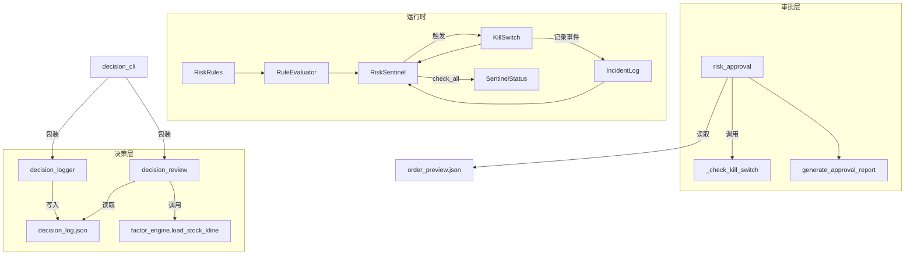

# Risk & Safety

# 风控安全模块 (Risk & Safety)

## 概述

风控安全模块是 Hermes 研究助手的风险控制核心，覆盖从**规则定义 → 实时监控 → 断路器 → 事件审计 → 人工审批 → 决策记录 → 事后复盘**的完整闭环。模块分为三个子包：

| 子包 | 职责 | 版本 |
|------|------|------|
| `risk/` | 规则引擎、哨兵监控、断路器、事件日志 | V4.4 |
| `approval/` | 风控审批 + Kill Switch 前置检查 + 人工确认 | V2.5 |
| `decision/` | 人工决策记录、事后复盘 | V1.13 |

### 依赖关系



---

## `risk/` — 风险监控核心 (V4.4)

包入口 `risk/__init__.py` 导出全部公开 API。核心分为四个模块。

### 1. Risk Rules (`risk_rules.py`)

**规则定义系统**，由三个核心类型构成：

#### `RiskRule` — 规则定义

每条规则包含名称、分类、严重度、阈值、重试策略和冷却时间：

```python
rule = RiskRule(
    name="daily_loss",                  # 唯一标识
    category="loss",                    # data / account / execution / loss / system
    severity="critical",                # info / warning / critical / blocker
    threshold=0.02,                     # 2% 日亏损阈值
    max_consecutive_failures=1,         # 触发即报警
    cooldown_seconds=3600,              # 触发后 1 小时冷却
    auto_recoverable=False,             # 日亏损不可自动恢复
)
```

#### `RuleCategory` / `RuleSeverity` / `RuleStatus` — 枚举

| 枚举 | 值 |
|------|----|
| `RuleCategory` | `data`, `account`, `execution`, `loss`, `system` |
| `RuleSeverity` | `info`, `warning`, `critical`, `blocker` |
| `RuleStatus` | `passed`, `violated`, `error`, `skipped` |

#### `RuleCheckResult` — 单次检查结果

记录检查时间、实际值、连续失败次数等。`is_violation()` 和 `is_blocker()` 是频繁使用的便捷方法。

#### `RuleEvaluator` — 规则评估引擎

两种评估模式：

- **阈值比较**（默认）：从 context 中取出数值，与 `rule.threshold` 比较，大于即违规
- **自定义评估器**：通过 `register_evaluator(rule_name, fn)` 注册，支持复杂逻辑（如数据新鲜度需结合时间戳判断）

```python
evaluator = RuleEvaluator()
evaluator.register_evaluator("data_freshness", my_custom_check)
result = evaluator.evaluate(rule, context={"value": 0.03})
```

#### `build_default_rules()` — 默认规则集

内置 13 条规则，涵盖五个维度：

| 维度 | 规则 | 严重度 | 作用 |
|------|------|--------|------|
| DATA | `data_freshness` | critical | 数据不超过 300s 未更新 |
| DATA | `price_missing_rate` | warning | 报价缺失率 < 5% |
| DATA | `market_connectivity` | critical | 行情源必须在线 |
| ACCOUNT | `account_connection` | critical | 交易账户在线 |
| ACCOUNT | `account_balance_anomaly` | critical | 余额不低于最低留存 |
| ACCOUNT | `position_concentration` | warning | 单票 ≤ 25% |
| EXECUTION | `consecutive_order_failures` | critical | 连续失败 ≤ 3 次 |
| EXECUTION | `fill_deviation` | warning | 成交偏差 ≤ 0.5% |
| EXECUTION | `slippage_anomaly` | warning | 平均滑点 ≤ 0.2% |
| LOSS | `daily_loss` | critical | 日亏损 ≤ 2% |
| LOSS | `drawdown` | critical | 回撤 ≤ 8% |
| LOSS | `daily_trade_count` | warning | 日交易 ≤ 50 次 |
| SYSTEM | `pipeline_consistency` | info | 管线一致性检查 |

---

### 2. Incident Log (`incident_log.py`)

**事件审计日志**，每条事件是不可变记录，状态迁移创建新记录并链接前驱。

#### `IncidentRecord` — 事件记录

```python
@dataclass
class IncidentRecord:
    incident_id: str           # INC_000001_20260707_143000
    rule_name: str
    severity: str              # info / warning / critical / blocker
    status: str                # open → acknowledged → resolving → resolved → closed
    category: str
    source: str
    details: dict
    related_incident_id: str   # 链接前驱事件
```

**生命周期**：`record()` → `acknowledge()` → `resolve()` → `close()`，允许 `reopen()` 回到 `open`。

#### `IncidentLog` — 日志存储

- **内存 + JSONL 持久化**：追加写入，确保审计溯源的不可篡改性
- **自动保存**：设置 `output_dir` 后每次变更自动写入
- **查询能力**：`find()`, `find_by_rule()`, `get_open_incidents()`, `get_active_blockers()`
- **`summary()`**：返回按状态的计数，包括活跃的 blocker / critical / warning 数量

```python
log = IncidentLog(output_dir="/path/to/logs")
incident = log.record("data_freshness", "critical", "数据超时未更新")
log.acknowledge(incident.incident_id, by="ops_robot")
log.resolve(incident.incident_id, resolution="数据源已恢复")
log.save()  # → /path/to/logs/incidents.jsonl
```

> `_auto_save()` 在每次 `record()` / `acknowledge()` / `resolve()` / `reopen()` 后自动调用，确保不丢失事件。

---

### 3. Kill Switch (`kill_switch.py`)

**全局断路器**，所有管线动作（下单、发信号、改配置）执行前必须通过 `check_action()`。

#### 状态机

```
ARMED ──trigger()──→ TRIGGERED ──start_recovery()──→ RECOVERING ──complete_recovery()──→ ARMED
  ↑                                                                                          │
  │                              DISABLED ←──disable()───────enable()────────────────────────┘
  └───────────────────────────────────────────────────────────────────────────────────────────┘
```

| 状态 | 含义 | 是否阻断 |
|------|------|----------|
| `ARMED` | 正常监控 | 否 |
| `TRIGGERED` | 断路器跳闸 | 是 |
| `RECOVERING` | 自动恢复中 | 是 |
| `DISABLED` | 维护模式（需审计） | 否 |

#### 核心方法

- **`trigger(rule_name, message)`**：跳闸，记录 blocker 级 incident，所有后续动作被阻断
- **`release(released_by, reason)`**：释放（需 `auto_recovery=True` 或 `force=True`）
- **`check_action(action_type, action_name)`**：每个动作前调用，返回 `{allowed, blocked, reason, kill_switch_state}`
- **`disable(disabled_by, reason)`**：禁用（须记录审计日志，仅用于维护）

```python
ks = KillSwitch(incident_log=log)

# 管线入口
check = ks.check_action("order", "send_order", source="execution_engine")
if not check["allowed"]:
    return {"error": check["reason"]}

# 哨兵触发
ks.trigger("daily_loss", "日亏损 2.5% 超过阈值")
```

#### `BlockedActionRecord` — 被阻断动作的记录

每次 `check_action()` 在阻塞状态返回时，自动创建记录并递增 `_block_count`。`get_blocked_action_report()` 导出全部阻断日志。

---

### 4. Risk Sentinel (`risk_sentinel.py`)

**统一风险监控哨兵**，组织规则引擎、事件日志和断路器之间的协作。

#### 工作流程

```python
sentinel = RiskSentinel(
    rules=build_default_rules(),
    incident_log=IncidentLog(),
    kill_switch=KillSwitch(),
    auto_trigger_kill_switch=True,  # BLOCKER 违规自动跳闸
)
sentinel.arm()
```

**完整检查周期 (`check_all`)**：

```
遍历全部规则 → RuleEvaluator 逐条评估
    ├── 违规 → IncidentLog.record()
    ├── BLOCKER 违规 + auto_trigger → KillSwitch.trigger()
    └── 通过 → 跳过
汇总 → SentinelStatus（含各维度状态 + incident 摘要）
```

**维度检查**：支持按维度单独检查 — `check_data()`, `check_account()`, `check_execution()`, `check_loss()`, `check_system()`。每个维度返回 `{dimension, status, n_violations, n_blockers, violations[], results[]}`。

#### `SentinelStatus` — 哨兵状态

```python
@dataclass
class SentinelStatus:
    status: str               # healthy / degraded / critical / blocked
    dimensions: dict          # {data: {status, violations}, account: {...}}
    kill_switch_state: str
    checks: list              # 仅包含违规的 check 结果
    incident_summary: dict
```

`is_healthy()` / `is_blocked()` / `is_critical()` 提供快速状态判断。

---

### 5. Pretrade Risk Check (`pretrade_risk_check.py`)

**盘前风控检查**（V4.4 之前的遗留模块）。对候选股票列表执行 A 股特有约束：

- `ST` / `*ST` 排除（通过 symbol 后缀判断）
- 成交额低于阈值排除（默认 100 万）
- 近 5 日涨幅过大提示（默认 > 30%）

注意：涨停/跌停/停牌的检查标记为未实现（`n_limit_up_flagged: 0`, `n_suspended_flagged: 0`），需后续完善。该模块正在被 V4.4 的规则引擎替代，但仍用于盘前候选股的快速过滤。

---

## `approval/` — 风控审批 (V2.5)

`risk_approval.py` 是**交易执行前的人工审批层**，不自动下单。

### `KILL_SWITCH` — 审批级阈值

独立于 `risk/` 的 Kill Switch，一组针对每日调仓审批的硬约束：

| 参数 | 默认值 | 含义 |
|------|--------|------|
| `max_daily_loss_pct` | 2% | 日亏损上限 |
| `max_position_weight` | 25% | 单票仓位上限 |
| `max_etf_weight` | 50% | ETF 替代上限 |
| `max_single_order_amount_pct` | 25% | 单笔买入金额上限 |
| `max_total_buy_amount_pct` | 70% | 总买入金额上限 |
| `min_cash_buffer_pct` | 2% | 最低现金缓冲 |
| `block_if_data_stale` | true | 数据过期则阻断 |
| `block_if_price_missing` | true | 价格缺失则阻断 |
| `block_if_order_preview_missing` | true | 无订单预览则阻断 |

### `run_approval()` — 审批入口

流程：

1. 加载 `order_preview.json`
2. 执行 `_check_kill_switch()`（检查数据新鲜度、价格完整、现金缓冲、集中度）
3. 逐笔订单分类：
   - **Kill switch 触发 → blocked**
   - **不可交易 → blocked**
   - **需人工确认 → second_confirmation**
   - **风险等级 warning → warning_only**
   - **单笔金额超限 → blocked**
   - **其余 → approved_for_manual_entry**
4. 检查总买入金额是否超限，超限则将尾部买入订单降级为 warning

### `generate_approval_report()` — 审批报告生成

输出到 `output_dir`：

| 文件 | 内容 |
|------|------|
| `approval_summary.json` | 完整审批结果 |
| `*_orders.csv` | 按分类导出的订单 CSV |
| `final_pretrade_risk_check.json` | Kill switch 检查结果 |
| `readonly_guard.json` | 只读保护 + 被阻断的方法列表 |
| `manual_confirmation_checklist.md` | 人工确认清单（Checklist） |
| `approval_report.html` | HTML 可视化报告 |
| `audit.log` | 审计日志摘要 |

**设计原则**：系统永不自动下单（`no_auto_order: True`），所有 approved 订单标注为 `"approved_for_manual_entry"`，用户需在券商软件手动输入。

---

## `decision/` — 决策记录与复盘 (V1.13)

### `decision_logger.py` — 人工决策日志

记录用户每日的操作决策，数据存储在 `daily_premarket/{date}/decision_log.json`。

#### `DECISION_SCHEMA`

```python
{
    "decision_date": "2026-07-07",
    "selected_plan": "B",        # A / B / C / none
    "user_action": "plan_b",     # no_action / observe_only / plan_a / custom
    "manual_buy": ["600519"],    # 人工增加的买入
    "manual_sell": ["000001"],   # 人工增加的卖出
    "manual_exclude": [],        # 人工排除的个股
    "confirmed_by_user": False,  # 是否最终确认
    "confirmed_at": None,
}
```

#### 重要逻辑

- **初始化**：`create_decision_log()` 尝试读取同目录下的 `unified_premarket_report.json`，自动填充 `unified_readiness`
- **更新**：`update_decision_log()` 部分更新已有日志，不覆盖未提供的字段
- **确认**：设置 `confirm=True` 时标记 `confirmed_by_user: True` 并记录确认时间戳

### `decision_review.py` — 事后复盘

扫描日期范围内每个交易日，获取策略候选股的后续收益。

#### 工作流

```
遍历日期范围 → 读取 decision_log.json + unified_premarket_report.json
    ├── 获取后续行情 → 计算 self Top5 等权 1/3/5 日收益
    ├── 行情不足 → 标记 pending（不捏造结果）
    └── 生成 → decision_review.json + decision_review_report.html
```

**关键设计**：

- **不假设未来数据**：仅当实际存在后续 K 线时才计算收益，不足则标记 `pending`
- **等权计算**：self Top5 股票等权，不含手续费
- **不反映人工修改**：`custom` 模式的实际修改记录在 `decision_log.json`，复盘仅展示原始方案

### `decision_cli.py` — CLI 接口

两个子命令：

```bash
# 创建/更新决策日志
factor-decision decision-log --date 2026-07-07 --plan B --action plan_b --buy 600519,000858

# 运行复盘
factor-decision review --start 2026-07-01 --end 2026-07-07
```

---

## 模块间交互

### 风控全链路（从信号到执行审批）

```
信号生成 → order_preview.json
    ↓
risk_approval.run_approval() ─── 检查 KILL_SWITCH → 订单分类 → 审批报告
    ↓
decision_logger.update_decision_log() ─── 记录人工决策
    ↓
generate_approval_report() ─── 输出 Checklist / HTML / 审计日志
    ↓
用户手动在券商软件执行
    ↓
decision_review.run_decision_review() ─── 事后复盘
```

### 运行时监控链

```
RiskSentinel.check_all() ─── 评估全部风险规则
    ├── 违规 → IncidentLog.record()
    ├── BLOCKER → KillSwitch.trigger() → 阻断所有动作
    └── 全部通过 → 报告 healthy
```

每个动作执行前：
```python
check = kill_switch.check_action("send_order", "600519")
if not check["allowed"]:
    raise RuntimeError(f"Kill switch 阻断: {check['reason']}")
```

### 数据流总结

```
                        ┌──────────────────┐
                        │  order_preview.json │
                        └────────┬─────────┘
                                 │ 读取
                                 ▼
                    ┌────────────────────────┐
                    │   risk_approval.py      │
                    │   run_approval()         │
                    └────────┬─────────┬───────┘
                             │         │
                    写入审批报告 │         │ 读取
                             ▼         ▼
                    ┌────────────┐  ┌────────────┐
                    │ 决策日志    │  │ 审批报告     │
                    │ decision_  │  │ HTML+CSV   │
                    │ log.json   │  │ +Checklist │
                    └──────┬─────┘  └────────────┘
                           │ 读取
                           ▼
                    ┌────────────┐
                    │ 事后复盘    │
                    │ decision_  │
                    │ review.py  │
                    └────────────┘
```

---

## 测试要点

参考现有测试文件（不在本次文档范围），以下场景已覆盖：

- **Approval**: `test_approval_from_order_preview`, `test_second_confirmation`, `test_checklist_generated`
- **IncidentLog**: 生命周期测试（`record → acknowledge → resolve → close`）、reopen、持久化（JSONL 读写）
- **RiskSentinel**: 共享 IncidentLog、多 check 周期历史
- **Decision**: 日志创建 / 更新 / 重载、复盘缺少未来数据时的 pending 处理

---

## 开发指引

### 添加新风险规则

```python
from factor_lab.risk import RiskRule, RuleCategory, RuleSeverity

rule = RiskRule(
    name="my_new_rule",
    category=RuleCategory.DATA.value,
    severity=RuleSeverity.WARNING.value,
    threshold=0.1,
    auto_recoverable=True,
)
sentinel.add_rule(rule)
# 如需自定义评估逻辑：
sentinel.register_custom_evaluator("my_new_rule", my_fn)
```

### 集成到管线

在管线入口处：

```python
# 1. Kill switch 检查
check = kill_switch.check_action(action_type, action_name, source)
if not check["allowed"]:
    logger.warning(f"Kill switch 阻断: {check['reason']}")
    return

# 2. 运行哨兵
status = sentinel.check_all(contexts={...})
if status.is_critical():
    logger.critical(f"哨兵报告危险状态: {status.status}")

# 3. 继续执行...
```

### 添加新审批检查

在 `_check_kill_switch()` 函数中添加新检查项，同时在 `KILL_SWITCH` 字典中定义阈值。注意审批级的 Kill Switch 独立于 `risk/` 的运行时 Kill Switch，两者不会自动同步。