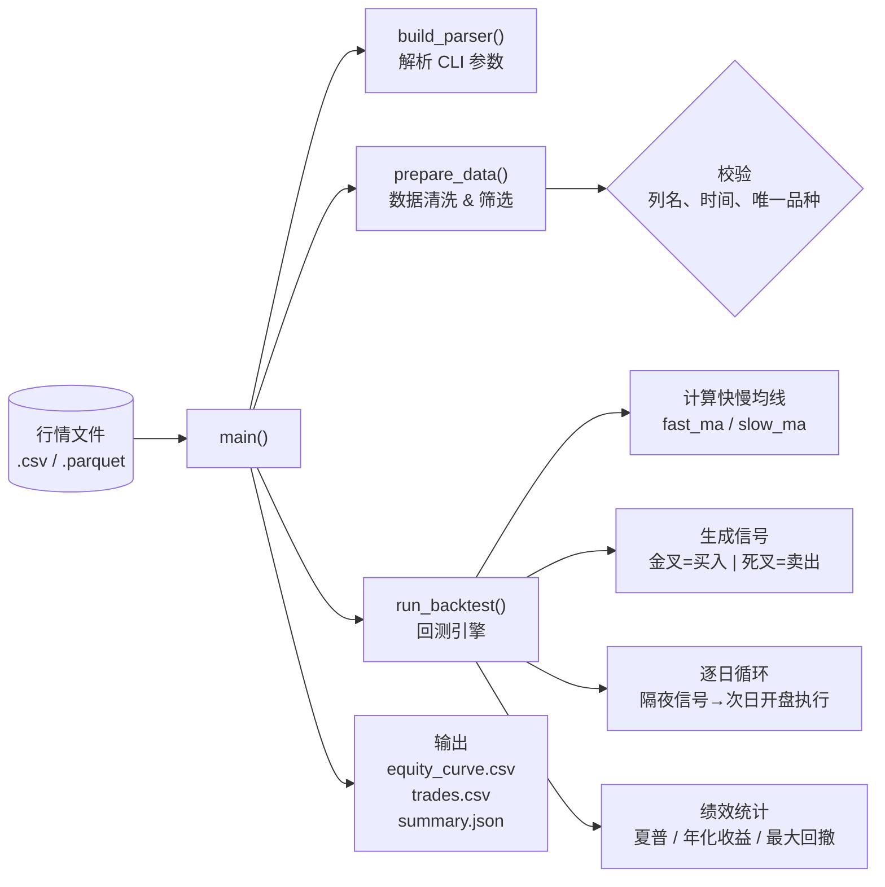
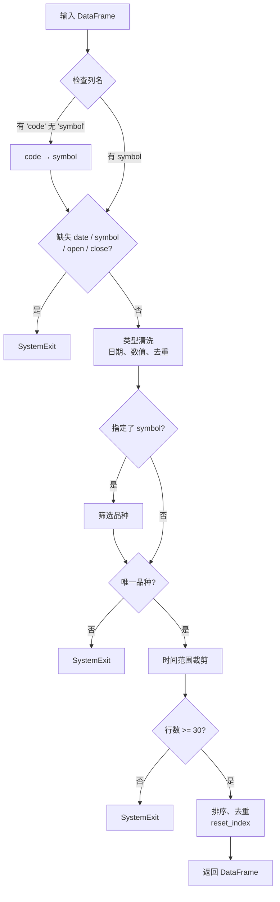

# Strategy & Portfolio — commands

# 简单均线回测模块 (`simple_ma_backtest.py`)

## 概述

本模块实现了一个**纯多头、双均线交叉**的经典回测框架。它从 CSV 或 Parquet 格式的日线行情数据中读取价格，以收盘价计算快慢两条移动平均线，在均线金叉/死叉的次日开盘执行交易，并输出完整的权益曲线、成交明细和绩效总览。



---

## 执行流程

`main()` 是模块的唯一入口，步骤如下：

1. **解析参数** — `build_parser()` 配置 13 个命令行选项，涵盖输入输出路径、品种代码、时间范围、均线周期、资金和交易成本。
2. **读取数据** — `read_table()` 根据后缀名自动选择 `pd.read_parquet` 或 `pd.read_csv`，兼容 `.csv` 和无后缀文件。
3. **数据预处理** — `prepare_data()` 完成列名统一、类型转换、品种筛选、时间裁剪，并确保只有 **一个品种** 参与回测。
4. **运行回测** — `run_backtest()` 是核心引擎，返回权益曲线 DataFrame、成交列表和绩效字典。
5. **结果输出** — 写到 `--output-dir` 目录下的三个文件（equity_curve.csv、trades.csv、summary.json），同时打印 summary 到 stdout。

---

## 核心数据结构

### `Trade` dataclass

```python
@dataclass
class Trade:
    entry_date: str          # 买入日期
    exit_date: str | None    # 卖出日期（未平仓为 None）
    entry_price: float       # 买入均价（含滑点）
    exit_price: float | None # 卖出均价（未平仓为 None）
    shares: int              # 成交股数
    gross_pnl: float | None  # 毛利
    net_pnl: float | None    # 净利（扣除全部费用后）
    return_pct: float | None # 该笔收益率
```

记录每笔从建仓到平仓的完整生命周期。回测结束时仍持仓的部分也会被追加到列表，但 `exit_*` 字段为 `None`。

---

## 关键函数详解

### `prepare_data()` — 数据准入

```python
def prepare_data(df, symbol, start, end) -> pd.DataFrame
```



准入规则：
- 至少 30 根日线，否则回测无统计意义
- 输入必须恰好一个品种（`unique()` 长度为 1）
- `date` 转为 `datetime` 后排序去重，同一日期保留最后一行
- 数值列做 `pd.to_numeric` + `dropna` 防止脏数据

### `run_backtest()` — 回测引擎

```python
def run_backtest(df, fast, slow, initial_cash, lot_size,
                 commission, stamp_duty, slippage_bps) -> (equity, trades, summary)
```

#### 信号生成

```
fast_ma = close.rolling(fast).mean()
slow_ma = close.rolling(slow).mean()

买入信号：fast_ma > slow_ma  且  前一日不满足（金叉）
卖出信号：fast_ma ≤ slow_ma  且  前一日满足    （死叉）
```

信号基于 **当日收盘价** 计算，但 **在次日开盘执行**。这一设计避免了同根 K 线的未来函数问题（look-ahead bias）。

#### 逐日循环逻辑

```
for i in range(1, len(df)):
    取 df.iloc[i-1] 的 signal  → 昨天收盘后的信号
    取 df.iloc[i] 的 open      → 今天的开盘价

    if signal == BUY  and 空仓:
        buy_price = open × (1 + slippage)
        max_shares = floor(cash / (buy_price × (1 + commission)))
        按 lot_size 取整
        扣除现金和佣金 → 建仓

    elif signal == SELL  and 持仓:
        sell_price = open × (1 - slippage)
        计算 gross/net PnL
        扣除佣金+印花税 → 落袋为安
        记录 Trade

    记录当日权益: cash + shares × close
```

#### 交易成本模型

| 参数 | 默认值 | 含义 |
|------|--------|------|
| `commission` | 0.0003 (0.03%) | 买卖双向佣金费率 |
| `stamp_duty` | 0.0005 (0.05%) | 卖出印花税（仅卖出时收取） |
| `slippage_bps` | 5.0 (0.05%) | 单边滑点，买入加价、卖出减价 |

### 绩效统计辅助函数

| 函数 | 算法 | 备注 |
|------|------|------|
| `max_drawdown(equity)` | `min(equity / cummax(equity) - 1)` | 历史最大回撤 |
| `annualized_return(equity, dates)` | `(终/初)^(365/天数) - 1` | 年化复利 |
| `sharpe_ratio(returns)` | `√252 × mean(ret) / std(ret)` | 年化夏普比，无风险利率为 0 |

> `sharpe_ratio` 使用 `std(ddof=0)`（总体标准差），这与传统金融计量习惯一致——回测中样本量通常足够大，分母差异可忽略。

### `build_parser()` — CLI 参数

```python
parser.add_argument("--input", required=True)      # 输入文件 (.csv / .parquet)
parser.add_argument("--symbol")                     # 品种代码，可选
parser.add_argument("--start")                      # 起始日期 "2020-01-01"
parser.add_argument("--end")                        # 截止日期
parser.add_argument("--fast", type=int, default=5)  # 快线周期
parser.add_argument("--slow", type=int, default=20) # 慢线周期
parser.add_argument("--initial-cash", default=100_000.0)
parser.add_argument("--lot-size", default=100)      # 整手股数
parser.add_argument("--commission", default=0.0003)
parser.add_argument("--stamp-duty", default=0.0005)
parser.add_argument("--slippage-bps", default=5.0)
parser.add_argument("--output-dir", required=True)  # 输出目录
```

---

## 输出格式

### `equity_curve.csv`

| 列 | 含义 |
|----|------|
| `date` | 交易日 |
| `cash` | 剩余现金 |
| `shares` | 持仓股数 |
| `close` | 当日收盘价 |
| `position_value` | 持仓市值 = shares × close |
| `equity` | 总权益 = cash + position_value |
| `return` | 日收益率（pct_change） |
| `signal_from_prior_close` | 前一收盘产生的信号 |

### `trades.csv`

每行一笔已平仓交易，字段对应 `Trade` dataclass。

### `summary.json`

```json
{
  "symbol": "000001",
  "first_date": "2020-01-02",
  "last_date": "2025-12-30",
  "initial_cash": 100000.0,
  "final_equity": 185632.4,
  "total_return": 0.856,
  "annualized_return": 0.132,
  "annualized_volatility": 0.185,
  "sharpe": 1.12,
  "max_drawdown": -0.234,
  "closed_trades": 24,
  "win_rate": 0.583,
  "turnover": 8.7,
  "assumptions": {
    "execution": "Signal from close on day T, trade at next open.",
    "fast_ma": 5,
    "slow_ma": 20,
    "lot_size": 100,
    "commission": 0.0003,
    "stamp_duty": 0.0005,
    "slippage_bps": 5.0
  }
}
```

---

## 设计要点

1. **避免未来函数是最高优先级。** 信号前一天收盘计算，后一天开盘执行——这是一个**朴素但正确**的模拟，所有辅助函数（`prepare_data` 的去重排序、信号逻辑中的 `shift(1)`、循环从 index 1 开始）都在为这个目标服务。

2. **默认参数对齐 A 股实盘。** 印花税 0.05%（卖出单边）、佣金 0.03% 双向、整手 100 股——这些默认值对标中国股票市场的典型费率，slippage 5bps 也接近中等流动性个股的冲击成本。

3. **模块是一等公民 CLI。** 设计为 `python -m commands.simple_ma_backtest --input ...` 即可独立运行，不依赖框架中的其他组件。这使得它既可用于快速策略验证，也可被上层流程（如 `leader` 模块的批量回测）以进程调用的方式驱动。

4. **输出是标准化的结构化数据。** equity_curve（时序）、trades（事件）、summary（聚合）三种输出覆盖了回测结果的主要分析维度，外部代码通过读取 json/csv 即可消费结果，无需 import 本模块。

---

## 在代码库中的位置

本模块是 `commands/` 目录下的一个独立 CLI 脚本，**不导出任何公共 API**。上层模块（如策略自动优化器、报告生成器）通过 `subprocess.run` 调用它并解析 stdout/输出文件来获取回测结果。这种进程级隔离保证了：

- 回测过程不影响主进程的内存状态
- 每个回测在干净的 Python 进程中运行，环境变量无冲突
- 支持不同 Python 版本或依赖的回测脚本共存

---

## 使用示例

```bash
# 基本用法：回测沪深300，快线5日/慢线20日
python commands/simple_ma_backtest.py \
    --input data/market/daily_000300.csv \
    --symbol 000300 \
    --start 2020-01-01 \
    --end 2025-12-31 \
    --output-dir output/sma_5_20

# 调整参数：快线10日/慢线60日，滑点10bps
python commands/simple_ma_backtest.py \
    --input data/market/daily_000300.parquet \
    --symbol 000300 \
    --fast 10 --slow 60 \
    --slippage-bps 10 \
    --initial-cash 500000 \
    --output-dir output/sma_10_60
```

---

## 局限与扩展方向

- **纯多头** — 不支持做空，信号改为 `-1` 时空仓而非做空。
- **固定仓位** — 每次开仓使用全部可用现金，无仓位管理。
- **单一品种** — `prepare_data` 强制要求输入恰好一个品种。
- **日线级别** — 未内置分钟线或多时间帧支持。
- **无风险模型** — 夏普比计算假设无风险利率为 0。
- **朴素滑点** — 滑点为固定比例，不基于市场深度或成交量。