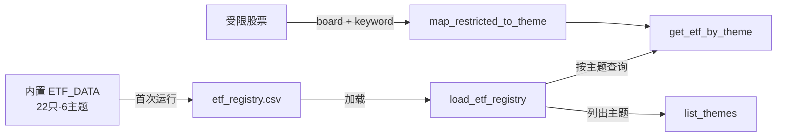

# Strategy & Portfolio — factor_lab

# Strategy & Portfolio — `factor_lab` 模块文档

> 版本: V6.4 (Portfolio) / V6.8 (Sector Rotation) / V1.10 (ETF Selector)
>
> 覆盖子包: `factor_lab.etf`, `factor_lab.portfolio`, `factor_lab.sector_rotation`

---

## 一、模块职责

`factor_lab` 的策略与组合模块负责从**信号到组合**的最后一公里。它解决的问题不是因子挖掘或选股信号生成——那些由 `factor_lab.factor` 和 `factor_lab.strategy` 处理——而是**把选股/择时信号组织成可执行的持仓方案**，包含三个层次：

| 层次 | 子包 | 职责 |
|------|------|------|
| **ETF 替代** | `etf` | 受限股票 → 主题 ETF 映射与筛选 |
| **组合回测** | `portfolio` | 多策略组合、权重再平衡、基准对比、指标计算 |
| **行业轮动** | `sector_rotation` | 行业评分 → 轮动信号 → 策略收益率 → 组合回测 |

这三个子包可以独立使用，也可以串联：ETF Selector 的输出可作为 Portfolio 的输入成分，Sector Rotation Engine 内部复用 `PortfolioBacktestEngine` 做最终指标计算。

---

## 二、ETF 替代 (`factor_lab.etf`)

### 2.1 解决的问题

当盘中受限股票（涨停、ST、权限不足等）无法买入时，需要找到**同主题的 ETF 作为替代**，而非简单跳过。这个子包提供了从受限信号到 ETF 候选的完整映射-筛选-评分-资金分配链路。

### 2.2 架构

```
受限股票列表
    │
    ▼
map_restricted_to_theme()    ← board + 关键词 → 推断主题
    │
    ▼
get_etf_by_theme()           ← 从注册表按主题匹配
    │
    ▼
run_etf_selector()           ← 硬性过滤 + 评分 + 排名 + 去重
    │                        ← 输出: candidate / rejected / unmatched
    ▼
CLI (etf_selector_cli.py)    ← 读预盘信号 → 写 JSON/CSV/HTML 报告
```

### 2.3 核心函数

#### `run_etf_selector()` — 入口

```python
from factor_lab.etf import run_etf_selector

result = run_etf_selector(
    restricted_candidates=[...],  # 受限股票列表
    capital=50000,                # 资金总额
    min_amount_20d=3000,          # 日均成交额下限(万)
    min_aum=5,                    # 规模下限(亿)
    max_expense_ratio=0.6,        # 费率上限(%)
    max_etf_per_theme=1,          # 每主题最多选几只
)
```

**处理流程（按顺序）:**

1. **主题推断** — 遍历受限股票，调用 `map_restricted_to_theme(board, keywords)` 映射。科创板 → 科创芯片/科创50，创业板 → 创业板成长/创业板。关键词命中 "芯片/半导体" 则提升为芯片主题。
2. **ETF 匹配** — `get_etf_by_theme(theme)` 从注册表按 `theme` 字段匹配；无精确匹配时做 `theme` 字段子串 fallback。
3. **硬性过滤** — 日均成交 < 3000万、规模 < 5亿、费率 > 0.6% 的 ETF 进入 `rejected` 列表，附带 `reject_reasons`。
4. **评分** — `_score_etf()` 六维打分后汇总:
   - 主题匹配度 (25-30 分, 科创芯片最高)
   - 持仓可查性 (10-15 分)
   - 流动性 (5-20 分, 按日均成交额区间)
   - 规模 (2-10 分)
   - 费率 (4-10 分)
   - 可交易性 (5 分)
   - 总分 → Grade: A(≥80) / B(≥60) / C(≥40) / D(<40)
5. **去重** — 默认每主题只保留 Top 1，未入选的自动进入 `backup_etfs`。
6. **资金计划** — `_build_capital_plan()` 等额分配，按 100 股整手取整。

#### `load_etf_registry()` — ETF 注册表

```python
etf_list = load_etf_registry(path=None)
```

返回 `list[dict]`，每个 dict 含 `etf_code`, `etf_name`, `exchange`, `theme`, `tracked_index`, `expense_ratio`, `aum`, `avg_amount_20d` 等字段。

数据优先级：如果 `data/etf/etf_registry.csv` 存在，从 CSV 加载；不存在则从内置 22 只 ETF 数据首次写入后加载。内置数据覆盖科创芯片、半导体设备、科创50/100、芯片、创业板、人工智能六大主题。

### 2.4 ETF 注册表数据流



### 2.5 CLI 使用

```bash
python commands/factor_lab/etf/etf_selector_cli.py \
    --from-live-signal /mnt/d/HermesReports/live_signals/20260703/premarket_signal.json \
    --capital 50000 \
    --output /path/to/output
```

输出文件（在 `output` 目录下）:
- `etf_selector.json` — 完整结果 (JSON)
- `etf_candidates.csv` — 候选 ETF (评分降序)
- `etf_rejected.csv` — 被过滤 ETF
- `etf_registry_snapshot.csv` — 注册表快照
- `etf_theme_summary.json` — 各主题汇总（含触发股票明细）
- `etf_data_freshness.json` — 数据质量检查
- `etf_selector_report.html` — 可视化 HTML 报告
- `audit.log` — 审计日志

---

## 三、组合回测 (`factor_lab.portfolio`)

### 3.1 解决的问题

多策略组合的构建、回测与评估。**不代替各策略的个股回测**（由 `factor_lab.strategy` 完成），而是聚焦于组合层面：接受各策略产出的收益率序列，组合为投资组合，再平衡，对比基准。

### 3.2 数据结构 (`spec.py`)

所有核心数据结构均定义为 dataclass：

```
PortfolioSpec          ← 组合配置（策略收益率 + 权重 + 再平衡频率）
BenchmarkSpec          ← 基准规格（名称或自定义收益率）
PortfolioMetrics       ← 组合层面指标（Sharpe/回撤/Alpha/Beta等）
AttributionItem        ← 单策略归因项
PortfolioResult        ← 完整回测结果
```

关键字段:

| 类 | 字段 | 含义 |
|----|------|------|
| `PortfolioSpec` | `strategy_returns` | `dict[str, pd.Series]` — 策略名 → 日收益率 |
| `PortfolioSpec` | `weights` | `dict[str, float]` — 策略名 → 权重 |
| `PortfolioSpec` | `rebalance_freq` | `"none" \| "monthly" \| "weekly" \| "daily"` |
| `PortfolioMetrics` | `sharpe` | 夏普比率 |
| `PortfolioMetrics` | `alpha` / `beta` | 相对于基准的 OLS 回归系数 |
| `PortfolioMetrics` | `tracking_error_pct` | 年化跟踪误差 |
| `PortfolioMetrics` | `information_ratio` | 信息比率 |
| `PortfolioMetrics` | `avg_cross_correlation` | 策略间平均交叉相关性 |
| `PortfolioResult` | `portfolio_returns` | 组合日收益率 |
| `PortfolioResult` | `portfolio_equity` | 组合净值曲线 |

`PortfolioSpec.validate()` 校验以下条件:
- 名称非空
- 策略收益率非空
- 每个策略都有权重配置
- 权重和 ≈ 1.0 (容忍 ±0.02)
- `rebalance_freq` 在合法集合内

### 3.3 回测引擎 (`portfolio_backtest.py`)

`PortfolioBacktestEngine` 是组合回测的核心，执行步骤如下:

```
PortfolioSpec
    │
    ▼
1. 对齐策略日期 ────── _align_strategy_returns()
    │                      concat(axis=1) + fillna(0)
    ▼
2. 构建权重计划 ────── _build_weight_schedule()
    │                      rebalance_freq 决定再平衡日
    ▼                       权重 = equal / fixed
3. 计算组合收益 ────── _compute_portfolio_returns()
    │                      dot(权重, 策略收益率)
    ▼
4. 净值曲线 ────────── (1 + portfolio_ret).cumprod()
    │
    ▼
5. 加载基准 ────────── get_benchmark_returns()
    │
    ▼
6. 计算指标 ────────── _compute_all_metrics()
    │                      绝对指标 + 基准对比 + 策略明细
    ▼
7. 归因 + 相关性 ───── compute_attribution()
    │                      + compute_cross_correlation()
    ▼
PortfolioResult
```

**再平衡机制的实现细节:**

- `rebalance_freq="none"`: 建仓后权重永久不动，随涨跌被动漂移
- `rebalance_freq="monthly"`: 每月第一个交易日重置权重
- `rebalance_freq="weekly"`: 每周一重置权重
- `rebalance_freq="daily"`: 每日重置权重
- `rebalance_method="equal"`: 所有策略等权
- `rebalance_method="fixed"`: 使用 `weights` dict 中的固定权重

```python
# 典型用法
from factor_lab.portfolio import PortfolioSpec, PortfolioBacktestEngine

spec = PortfolioSpec(
    name="保守组合",
    strategy_returns={"动量": mom_ret, "价值": val_ret},
    weights={"动量": 0.4, "价值": 0.6},
    rebalance_freq="monthly",
)
engine = PortfolioBacktestEngine(spec)
result = engine.run_with_benchmark("CSI300")

# 查看结果
result.metrics.sharpe        # 组合 Sharpe
result.metrics.alpha         # Alpha (相对于基准)
result.metrics.beta          # Beta
result.attribution           # 各策略归因列表
result.cross_correlation     # 策略相关性矩阵
```

### 3.4 指标计算 (`metrics.py`)

指标函数细分三层：

**绝对指标** — `compute_portfolio_absolute_metrics()`
- 累计收益、年化收益/波动、Sharpe、最大回撤、Calmar、胜率（日频）
- 底层复用 `factor_lab.metrics.calc_sharpe/calc_max_drawdown/calc_calmar`

**基准对比** — `compute_benchmark_relative_metrics()`
- 基准累计收益/年化/波动/Sharpe/最大回撤
- 主动收益（超额累计）、跟踪误差（年化）、信息比率
- Alpha/Beta（OLS 回归，使用超额收益率）、R²

**策略间分析** — `compute_cross_correlation()` / `compute_avg_correlation()`
- 策略收益率相关性矩阵
- 上三角均值作为平均交叉相关性

**归因分析** — `compute_attribution()`
- 边际贡献 = 权重 × 策略累计收益
- 贡献百分比 = 边际贡献 / 总边际贡献
- 附带各策略 Sharpe 和与组合的相关性

综合入口 `compute_portfolio_metrics()` 一站式返回所有指标。

### 3.5 基准数据 (`benchmark.py`)

支持四种标准指数和一种自定义模式:

| 名称 | 代码 | 描述 |
|------|------|------|
| CSI300 | 000300.SH | 沪深300 — 大盘蓝筹 |
| CSI500 | 000905.SH | 中证500 — 中盘 |
| CSI1000 | 000852.SH | 中证1000 — 小盘 |
| CSI_ALL | 000985.SH | 中证全指 — A股全市场 |
| custom | — | 用户自定义收益率序列 |

```python
from factor_lab.portfolio import get_benchmark_returns, make_benchmark_spec

# 方式一: 通过 spec
spec = make_benchmark_spec("CSI500")
returns = get_benchmark_returns(spec, index_dates=dates, method="synthetic")

# 方式二: 自定义
custom_spec = BenchmarkSpec(name="custom", returns=my_series)
```

当前数据获取方法:
- `method="synthetic"`: 按各指数特征（收益/波动参数）生成模拟日收益率，用于测试开发
- `method="etf_proxy"`: 通过指数 ETF 行情获取，**当前未接入真实数据源**，降级为 synthetic 并记录 `partial` 警告

### 3.6 报告输出 (`report.py`)

```python
from factor_lab.portfolio import print_summary, format_report, save_report

# 终端摘要 (人类可读)
print_summary(result)

# 结构化 dict (可序列化)
report_dict = format_report(result)

# 保存 JSON 文件
path = save_report(result, output_dir="/path/to/reports")
```

`format_report()` 会将 `PortfolioResult` 中的 `pd.Series`/`pd.DataFrame` 排除，同时将相关性矩阵展开为 `[{strategy_i, strategy_j, correlation}]` 列表形式以便 JSON 序列化。

### 3.7 持仓与调仓相关（辅助模块）

#### `position_loader.py` — 持仓加载

```python
from factor_lab.portfolio.position_loader import PositionLoader

loader = PositionLoader()
positions = loader.load_csv("positions.csv")     # 从 CSV
positions = loader.load_json("positions.json")   # 从 JSON
positions = loader.from_qmt()                    # 从 QMT 实时拉取
```

校验规则:
- `shares` 必须是 100 的整数倍
- `available_shares` ≤ `shares`
- `market_value` 与 `shares * current_price` 偏差超过 1% 时记录警告
- symbol 为 "CASH" 的行自动识别为现金

#### `rebalance_diff.py` — 调仓差异

```python
from factor_lab.portfolio.rebalance_diff import run_rebalance_diff

result = run_rebalance_diff(
    date="2026-07-03",
    positions_csv="/path/to/positions.csv",
    plan="B",        # A=conservative / B=balanced / C=aggressive
    capital=50000,
)
```

对比当前持仓与预盘信号中的目标持仓，将每只股票分类到:
- `hold` — 无需操作
- `reduce` — 超配需减仓（计算减仓股数）
- `sell` — 清仓卖出
- `risk_sell` — 风控卖出（科创板/创业板权限不足、ST等）
- `buy` — 新买入候选
- `skip` — 因权限不足跳过
- `watch` — 观察名单

同时估算调仓费用（佣金 0.03% + 印花税 0.1% + 滑点 10bps）和调仓后现金。

#### `portfolio_review.py` — 组合复盘

```python
from factor_lab.portfolio.portfolio_review import run_portfolio_review, generate_review_report

review = run_portfolio_review(date="2026-07-03")
generate_review_report(review, output_dir="/path/to/output")
```

复盘覆盖五个维度:
1. **执行符合度** — matched/missed/manual_overrides/partial/rejected 统计
2. **机会成本** — 未执行建议的后续收益（1/3/5日）
3. **人工 override 分析** — 人工干预收益对错
4. **持仓贡献** — 各持仓的后续表现
5. **组合偏离** — 目标 vs 实际的买入/卖出差异
6. **ETF 替代效果** — 替代 ETF 的市场收益近似估算

---

## 四、行业轮动 (`factor_lab.sector_rotation`)

### 4.1 解决的问题

在 A 股行业层面执行轮动策略：按调仓频率计算各行业绩效 → 策略评分排名 → 选择 Top-N 行业 → 构建轮动策略收益率 → 组合回测。

### 4.2 整体架构

```
个股收益率 DataFrame   行业映射 (IndustryMapper)
    │                         │
    ▼                         ▼
compute_sector_returns() ← get_sector_mapping()
    │
    ▼
SectorPerformance[] (行业绩效快照)
    │
    ▼
ISectorRotationStrategy.rank_sectors()
    │                   Momentum / MeanReversion / Composite
    ▼
排名 + 选行业 + 定权重
    │
    ▼
RotationSignal[] (信号序列)
    │
    ▼
_build_rotation_strategy_returns() → 策略日收益率
    │
    ▼
PortfolioBacktestEngine.run_with_benchmark()
    │
    ▼
RotationResult
```

### 4.3 数据结构 (`spec.py`)

```
SectorRotationConfig    ← 轮动配置（策略类型/参数/行业白名单）
SectorPerformance       ← 单行业绩效（动量/波动/资金流等）
RotationSignal          ← 一次调仓信号（选中行业/权重/排名）
RotationResult          ← 完整回测结果（含 PortfolioResult）
RotationStrategyType    ← 枚举: MOMENTUM / MEAN_REVERSION / COMPOSITE
```

`SectorRotationConfig` 的关键参数:

| 参数 | 类型 | 默认值 | 说明 |
|------|------|--------|------|
| `strategy_type` | `RotationStrategyType` | 必需 | 策略类型 |
| `top_n` | int | 5 | 每次调仓选中行业数 |
| `rebalance_freq` | str | `"monthly"` | 调仓频率 |
| `lookback_short` | int | 20 | 短期回看窗口（日） |
| `lookback_medium` | int | 60 | 中期回看窗口（日） |
| `min_sectors` | int | 3 | 最少可轮动行业数 |
| `equal_weight` | bool | True | 选中行业是否等权 |
| `sectors` | list[str]\|None | None | 行业白名单（None=全部） |

### 4.4 三种轮动策略 (`rotation_strategies.py`)

所有策略实现 `ISectorRotationStrategy` 接口：

```python
class ISectorRotationStrategy(ABC):
    def name(self) -> str: ...
    def rank_sectors(self, performances: list[SectorPerformance]) -> list[dict]: ...
    def select_sectors(self, rankings: list[dict], top_n: int) -> list[str]: ...
```

**策略 1：MomentumRotation（动量轮动）**

```
Score = return_short × 0.6 + return_medium × 0.3 + return_long × 0.1
```

短期动量权重最高。买入近期涨幅最强的行业。

**策略 2：MeanReversionRotation（均值回归）**

```
Score = (-return_short × 0.7 + -return_medium × 0.3) × vol_penalty
```

短期表现越差评分越高。同时用波动率惩罚：当日波动率 > `max_volatility=0.04` 时降权，过滤异常波动行业。

**策略 3：CompositeRotation（复合轮动）**

```
各维度 Z-Score 标准化后加权:
Score = momentum_weight × Z(momentum)
      + low_vol_weight × (-Z(volatility))
      + fund_flow_weight × Z(fund_flow)
```

默认权重: 动量 0.5, 低波动 0.3, 资金流 0.2。

策略工厂函数 `create_strategy(config)` 根据 `config.strategy_type` 自动创建对应实例。

### 4.5 轮动引擎 (`rotation_engine.py`)

`SectorRotationEngine` 是轮动回测的调度中心：

```python
from factor_lab.sector_rotation import (
    SectorRotationConfig, SectorRotationEngine, RotationStrategyType,
)

config = SectorRotationConfig(
    name="复合轮动",
    strategy_type=RotationStrategyType.COMPOSITE,
    top_n=5,
    rebalance_freq="monthly",
)
engine = SectorRotationEngine(config)
result = engine.run(stock_returns=stock_return_df)
```

`run()` 方法的内部流程:

```
1. load sector mapping           ← get_sector_mapping() 或参数传入
2. compute sector returns        ← 个股收益率按行业聚合
3. filter sectors                ← config.sectors 白名单
4. get rebalance dates           ← 按频率计算调仓日
5. for each rebalance date:      ← 循环生成信号
   a. compute performance snapshot
   b. strategy.rank_sectors()
   c. strategy.select_sectors()
   d. determine weights           ← equal_weight 或按评分
   e. create RotationSignal
6. build strategy returns         ← 按信号周期拼接日收益率
7. run portfolio backtest         ← 复用 PortfolioBacktestEngine
8. return RotationResult
```

**换手率计算:** `_calc_turnover()` 衡量每次调仓时行业集合的变化比例，计算公式为 `symmetric_difference / max(两期数量)`。

### 4.6 行业绩效计算 (`sector_performance.py`)

```python
from factor_lab.sector_rotation import (
    compute_sector_returns,       # 个股 → 行业收益率
    compute_sector_rankings,      # 行业排名
    get_sector_mapping,           # symbol → sector 映射
    get_stocks_by_sector,         # sector → symbols 列表
)

# 行业收益率
sector_returns = compute_sector_returns(stock_returns_df, sector_mapping)

# 行业排名
rankings = compute_sector_rankings(sector_returns, as_of_date="2026-07-03")
```

底层通过 `factor_lab.alpha.industry_mapper`（Industry Mapper）获取行业分类。行业映射支持申万一级行业（默认基于 `data/industry/industry_map.csv`）。

---

## 五、模块间关系

```mermaid
flowchart LR
    subgraph 数据源
        A[个股行情] --> C[industry_mapper]
        A --> D[ETF Registry]
    end
    
    subgraph ETF
        D --> E[ETF Selector]
        F[受限信号] --> E
    end
    
    subgraph 行业轮动
        A --> G[行业绩效]
        G --> H[轮动策略]
        H --> I[RotationSignal]
        I --> J[策略收益率]
    end
    
    subgraph 组合回测
        J --> K[PortfolioBacktestEngine]
        E --> K
        L[策略收益率] --> K
        K --> M[PortfolioResult]
    end
    
    subgraph 持仓
        N[QMT] --> O[PositionLoader]
        O --> P[RebalanceDiff]
        M --> P
        P --> Q[PortfolioReview]
    end
    
    style K fill:#1a1a2e,stroke:#00bcd4,stroke-width:2px
```



### 依赖关系

- `portfolio` → `factor_lab.metrics`（Sharpe/回撤/Calmar）
- `portfolio.metrics` → `factor_lab.metrics.calc_sharpe`, `calc_max_drawdown`, `calc_calmar`
- `sector_rotation.sector_performance` → `factor_lab.alpha.industry_mapper`（行业分类）
- `sector_rotation.rotation_engine` → `factor_lab.portfolio.PortfolioBacktestEngine`
- `etf.etf_universe` → 外部 CSV 文件 `data/etf/etf_registry.csv`
- `portfolio.portfolio_review` → `factor_lab.factor_engine.load_stock_kline`（后续行情）
- `portfolio.rebalance_diff` → `factor_lab.live.account_profile`（交易权限）
- `portfolio.position_loader` → `factor_lab.miniqmt`（实时仓位，可选）
- `portfolio.report` → `$HERMES_REPORTS_DIR/portfolio/`（输出目录）

### 关键设计决策

1. **收益率序列作为接口** — 模块间的数据传递不依赖 pandas DataFrame 之外的格式，策略产出收益率，组合消费收益率。解耦清晰，便于单元测试。

2. **Synthetic 基准** — 由于缺少实时指数数据库，基准数据使用合成数据，所有缺失数据标记为 `partial` 不允许静默降级。`etf_proxy` 模式预留了通过指数 ETF 行情获取真实收益的接口，待数据源接入后启用。

3. **信号分离** — 轮动引擎中的信号生成（`_generate_signals`）与组合回测（`PortfolioBacktestEngine`）完全分离。信号是一个明确的数据产品（`RotationSignal` 列表），可以不经过回测直接用于分析。

4. **ETF 替代不是收益对齐** — `etf_selector` 的输出附带明确说明: "ETF 替代不是一比一复制个股收益，而是主题暴露替代"。

---

## 六、测试结构

模块相关的测试文件分布在 `commands/tests/`:

| 测试文件 | 覆盖模块 | 核心用例数 |
|----------|----------|----------|
| `test_etf_registry_load.py` | `etf.etf_universe` | 2 |
| `test_etf_theme_classifier.py` | `etf.etf_universe.map_restricted_to_theme` | 3 |
| `test_etf_selector_scoring.py` | `etf.etf_selector` | 3 |
| `test_etf_reject_report_plan.py` | `etf.etf_selector` | 3 |
| `test_portfolio_backtest.py` | `portfolio` 全部 | 10+ |
| `test_portfolio_review_deep.py` | `portfolio.portfolio_review` | 5 |
| `test_rebalance_diff.py` | `portfolio.rebalance_diff + position_loader` | 3 |
| `test_strategy_report.py` | `portfolio` (间接) | 2 |