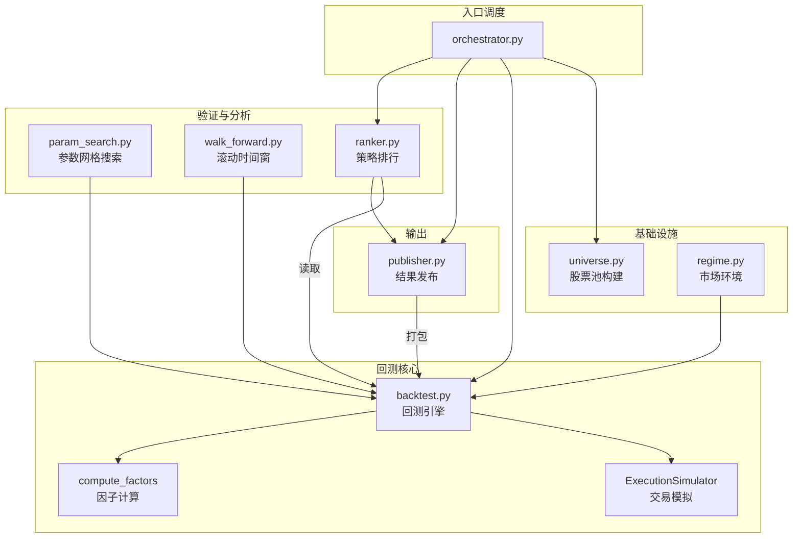

# Strategy & Portfolio — strategy_lab

# Strategy Lab — 策略挖掘与回测框架

## 概述

Strategy Lab 是 Hermes Research Assistant 的策略研究与验证子系统，提供了从**股票池构建 → 因子计算 → 回测执行 → 参数搜索 → 滚动验证 → 市场环境分析 → 策略排行 → 结果发布**的完整闭环。该模块以半导体/AI 等主题策略为主要研究对象，设计上强调**可复现性**与**结构化评审流程**。

模块位于 `commands/strategy_lab/`，由 9 个文件构成，核心是 Orchestrator → Backtest Engine 两层架构。

## 架构总览



**数据流向**：策略 YAML 配置 → Orchestrator 加载 → Backtest Engine 执行 → 结果写入 `performance/` 和 `research_outputs/` → Publisher 打包至 Codex `incoming_from_hermes/`。

## 文件详解

### 1. 股票池构建器 — `universe.py`

负责从多个数据源聚合股票池，每个 universe 同时输出 CSV 文件和 JSON 元数据。元数据中显式标记两类偏差：

- **生存者偏差**（survivorship_bias）：标签基于当前股票，已退市/ST 股票不在池中
- **标签时序偏差**（label_timing_bias）：概念/产业链标签无历史生效日期

内置 4 个构建器，注册在 `UNIVERSE_BUILDERS` 字典中：

| Universe | 数据源 | 偏差标记 |
|---|---|---|
| `semiconductor_theme` | 半导体产业链标签 + 行业分类 | 两类偏差均为 `true` |
| `ai_cpo_pcb_storage` | 主题标签（AI/CPO/PCB/存储/光模块） | 两类偏差均为 `true` |
| `manual_watchlist` | 手工关注列表 CSV | 均为 `false` |
| `today_candidates` | 当日候选 CSV | 均为 `false` |

所有构建器签名一致：`build_xxx() -> tuple[list[dict], dict]`，第一项为股票列表，第二项为元数据。外部模块通过 `build(name)` 统一调用。

`universe.build()` 是整个代码库中调用最广泛的基础设施函数——被 factor_lab 的 pipeline、validator、scoring 等 10+ 个模块引用。

### 2. 回测引擎 — `backtest.py`

核心回测逻辑，实现 **T 日收盘信号 → T+1 开盘成交** 的多标的多因子回测。

#### 关键设计

**信号驱动机制**：
```
T-1 日收盘 → 计算因子 → 生成评分 → 选股排名
    ↓
T 日开盘 → 按 T-1 信号执行买卖（考虑滑点）
```

**因子计算** — 注册在 `FACTOR_FUNCS` 字典：

| 因子名 | 含义 | 归一化方法 |
|---|---|---|
| `ret20` | 过去 20 日收益率 | 映射 `[-0.2, 0.5]` → `[0, 100]` |
| `ma20_gt_ma60` | 20 日均线 > 60 日均线 | 布尔值 × 100 |
| `vol_ratio20` | 当日成交量 / 20 日均量 | `value × 50`，截断至 `[0, 100]` |

因子可扩展：在 `FACTOR_FUNCS` 中注册新函数即可。

**组合评分**：每只股票的最终得分 = Σ(因子值 × 权重)，取 top_n 为调仓目标。

#### ExecutionSimulator

交易约束模拟器，参数化配置：

```python
cost_cfg = {
    "commission_rate": 0.0003,   # 佣金费率
    "min_commission": 5,          # 最低佣金
    "stamp_tax_rate_sell": 0.0005, # 卖出印花税
    "slippage_bps": 5,            # 滑点（基点）
    "lot_size": 100,              # 最小交易单位
}
```

提供三个方法：`buy_cost`（买入成本）、`sell_proceeds`（卖出净收入）、`max_shares`（按现金约束计算最大可买股数）。

#### 回测输出

返回包含以下字段的 dict：

| 字段 | 说明 |
|---|---|
| `strategy` | 策略名称 |
| `data_range` | 回测日期范围 |
| `initial_cash / final_equity` | 初始 / 最终资产 |
| `total_return` | 总收益率 |
| `max_drawdown` | 最大回撤 |
| `closed_trades / total_trades` | 已平仓 / 总交易次数 |

`run()` 函数支持三个关键参数：
- `start_date / end_date`：限定日期范围，被 walk_forward 和 regime 模块使用
- `factor_weight_overrides`：在运行时覆盖 YAML 配置中的因子权重，是 param_search 的核心接口

### 3. 入口调度 — `orchestrator.py`

Orchestrator 是 Strategy Lab 的对外门面，被 CLI 主入口 `hermes_cli.py` 直接调用。提供以下方法：

| 方法 | 功能 | 输出目标 |
|---|---|---|
| `init()` | 创建策略实验室目录结构 | 无 |
| `list_strategies()` | 扫描策略目录列出所有可用策略 | stdout |
| `load_strategy(name)` | 加载 YAML 配置（按 templates → active → candidates 顺序查找） | Python dict |
| `mine_candidates()` | 生成候选策略清单（预置 3 个半导体策略假设） | `strategy_mining/` |
| `run_backtest(name)` | 执行单策略回测并写 summary.json | `performance/backtests/{name}/` |
| `build_review_material(name)` | 生成结构化评审材料 JSON | `strategy_review_material/` |
| `build_latest_signals(name)` | 生成当日交易信号 CSV | `performance/signals/` |

**策略目录约定**：
```
strategies/
├── templates/     # 模板策略（由 mine_candidates 生成）
├── active/        # 活跃策略（可选）
├── candidates/    # 候选策略（待评审）
└── archived/      # 存档策略
```

### 4. 参数搜索 — `param_search.py`

对任意策略执行**笛卡尔积网格搜索**，每次组合调用真实回测引擎。

```python
GRID = {
    "semiconductor_trend_following": {
        "top_n": [5, 10, 15],
        "ret20_weight": [0.20, 0.25, 0.30],
        "vol_ratio20_weight": [0.10, 0.15, 0.20],
    },
}
```

搜索结果的参数组合按 `total_return` 降序排列。最终报告包含：

- **最佳参数组合**与对应收益/回撤
- **收益范围**（min / max / std）
- **过拟合风险评估**：组合数 < 30 标记 `low`，否则 `medium`
- **稳定性提示**：若最佳参数在 grid 边界，提示扩展搜索范围

输出两文件：`parameter_grid_results.csv`（全量结果）和 `parameter_report.json`（汇总报告）。

### 5. 滚动验证 — `walk_forward.py`

两层训练/验证窗口：

| 窗口 | 训练期 | 验证期 |
|---|---|---|
| 1 | 2025-01-02 → 2025-08-31 | 2025-09-01 → 2025-12-31 |
| 2 | 2025-05-01 → 2025-12-31 | 2026-01-01 → 2026-07-03 |

验证通过条件：所有验证窗口总收益率 > -5%。结果写入 `walk_forward_report.json`，标记 `parameter_stability` 和 `walk_forward_pass`。

### 6. 市场环境分析 — `regime.py`

按年度划分 6 个时间段（2020–2026），以 SSE 指数（000001）收益划分市场状态：

| 条件 | 市场状态 |
|---|---|
| SSE 收益 > 10% | `bull` |
| SSE 收益 < -5% | `bear` |
| 其余 | `sideways` |

每个时间段运行独立回测（通过回调函数 `backtest_fn`），输出策略收益与 SSE 收益的对比表。

### 7. 策略排行 — `ranker.py`

扫描 `performance/backtests/` 下所有子目录的 `summary.json`，构建排行榜。

输出三个文件：

| 文件 | 内容 |
|---|---|
| `strategy_registry.csv` | 全部策略，按总收益降序 |
| `strategy_leaderboard.csv` | 前十名 |
| `strategy_risk_dashboard.json` | 含警告信息与模拟交易候选清单 |

**模拟交易候选条件**：最大回撤 < 10% 且总收益 > 5%。

### 8. 结果发布 — `publisher.py`

打包 Strategy Lab 全量结果至 Codex 数据管道 `incoming_from_hermes/`。打包范围：

- `performance/` 下的 CSV 和 JSON
- `performance/backtests/{strategy}/*`
- `performance/signals/*`
- `research_outputs/strategy_review_material/*.json`

发布流程使用**原子操作**——先写 `.tmp` 目录再 `rename` 为最终目录，并写入 `_SUCCESS` 标记文件和带 SHA256 校验的 `manifest.json`。

### 9. 因子注册 — `factor_registry.py`（待实现）

`__init__.py` 列出了 `factor_registry.py`，但当前尚未实现。预期作用是统一管理因子元数据（因子名、计算函数、归一化参数、相关性约束等）。

## 执行流程示例

典型的策略研究管线（CLI 触发顺序）：

```
1. orchestrator.init()
   → 创建目录结构

2. universe.build("semiconductor_theme")
   → 构建股票池 → research_outputs/universes/

3. mine_candidates()
   → 生成候选策略假设 → strategy_mining/

4. build_review_material("semiconductor_trend_following")
   → 初始化评审材料

5. run_backtest("semiconductor_trend_following")
   → 执行回测 → performance/backtests/{name}/

6. run_parameter_grid("semiconductor_trend_following")
   → 参数稳定性测试

7. run_walk_forward("semiconductor_trend_following")
   → 滚动时间窗验证

8. analyze_regime("semiconductor_trend_following")
   → 分市场环境评估

9. rank_strategies()
   → 排行榜刷新

10. publish_results()
    → 打包 → incoming_from_hermes/
```

## 与外部模块的集成

Strategy Lab 的 `universe.build()` 是最深嵌入 factor_lab 的基础设施：

```
factor_lab/pipeline.py         ── load_universe → build()
factor_lab/validate_factor.py   ── run_validation → build()
factor_lab/scoring/leaderboard.py ── run_batch_validation → build()
factor_lab/live/signal_generator.py ── _get_symbols_for_universe → build()
mcp_server.py                   ── tool_score_factor → ... → build()
```

其他模块间的关系：

```
hermes_cli.py ←→ orchestrator.py (主入口)
orchestrator.py → backtest.run() (回测执行)
param_search.py → backtest.run() (参数搜索)
walk_forward.py → backtest.run() (滚动验证)
regime.py → backtest.run() (环境分析)
orchestrator.run_backtest() / param_search / walk_forward → 三者独立，互不依赖
```

## 偏差与风险告知

Strategy Lab 在设计中保留了显式的偏差标记和风险提示：

1. **生存者偏差**：半导体主题池基于当前标签构建，不包含已退市/ST 股票，历史回测可能高估收益
2. **标签时序偏差**：概念标签无生效日期，回测中使用了"未来才知道的分类"
3. **参数过拟合**：网格搜索超过 30 种组合时自动标记 `overfit_risk: medium`
4. **评审材料结构**：`build_review_material()` 强制包含 `weaknesses`、`failure_periods`、`bias_warnings` 等字段，确保策略上架前经过结构化反思

## 扩展指南

### 添加新因子

在 `backtest.py` 中注册：

```python
def compute_factor_new(rows: list[dict]) -> list[Optional[float]]:
    # 计算逻辑
    pass

FACTOR_FUNCS["new_factor"] = compute_factor_new
```

同时在打分逻辑中添加归一化分支。

### 添加新 Universe

在 `universe.py` 中注册构建器：

```python
def build_my_custom() -> tuple[list[dict], dict]:
    codes = [...]
    metadata = {
        "universe_name": "my_custom",
        "survivorship_bias_warning": "true",
        "label_timing_bias_warning": "false",
    }
    return [{"symbol": c, "universe": "my_custom"} for c in codes], metadata

UNIVERSE_BUILDERS["my_custom"] = build_my_custom
```

### 添加新策略

创建 YAML 配置文件 → 放入 `strategies/templates/` → `mine_candidates()` 添加条目。

## 文件清单

| 文件 | 行数（约） | 职责 |
|---|---|---|
| `orchestrator.py` | 120 | 入口调度、策略加载、评审材料生成 |
| `backtest.py` | 250 | 核心回测引擎、因子计算、交易模拟 |
| `universe.py` | 130 | 股票池构建、偏差标记、多数据源聚合 |
| `param_search.py` | 80 | 参数网格搜索、过拟合风险评估 |
| `walk_forward.py` | 60 | 滚动时间窗验证 |
| `regime.py` | 80 | 市场环境划分与分段回测 |
| `ranker.py` | 80 | 策略排行、注册表、风险看板 |
| `publisher.py` | 110 | 原子打包发布、SHA256 校验 |
| `__init__.py` | <10 | 模块概览 |